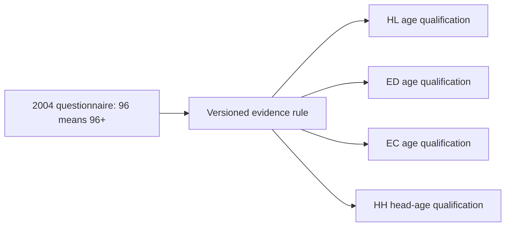

# 2004 age top-code qualification interface

Status: **published after explicit user approval**, following local tests, read-only preflight,
verified external backup and a successful transaction rollback rehearsal. This follows the accepted
[questionnaire review](cses-questionnaire-review.md). The existing physical age columns, canonical
definitions, historical questionnaire packages, housing interfaces and database graph v10 remain
unchanged. No new question links or cross-wave mappings are included.

Independent post-publication validation passed. See the
[release record and graph v11](releases/cses-age-2004-topcode-v1.md) for the committed object identities,
backup, rollback rehearsal and protected-state results. All 188 tests passed. Ready-to-run
[read-only SQL examples](../rsc/sql/cses_age_topcode_examples.sql) have also been verified.

## Published interface

The additive interface uses the existing `cses_analysis` schema, without a new schema or physical copy.

| Published view | Source | Grain | Rows |
| --- | --- | --- | ---: |
| `cses_hl_age_v1` | `cses_data."final_HL_CSES"` | Member-wave | 358,920 |
| `cses_ed_age_v1` | `cses_data."final_ED_CSES"` | Education record-wave | 343,204 |
| `cses_ec_age_v1` | `cses_data."final_EC_CSES"` | Employment record-wave | 332,903 |
| `cses_hh_head_age_v1` | `cses_data."final_HH_CSES"` | Household-wave | 77,904 |
| `cses_age_2004_rule_v1` | Four explicit evidence records | Target table / source age field | 4 |

Each of the first four views retains every existing column and row through `SELECT b.*`, with no
join or row filter, then adds these four fields. In the household view they describe
`household_head_age`; in the other views they describe `age`.

| New field | Valid 2004 age 0–95 | 2004 code 96 | Missing 2004 age | Any other wave |
| --- | --- | --- | --- | --- |
| `age_2004_is_topcoded` | false | true | NULL | NULL |
| `age_2004_lower_bound` | original completed years | 96 | NULL | NULL |
| `age_2004_exact_years` | original completed years | NULL | NULL | NULL |
| `age_2004_status` | `reported_completed_years` | `topcoded_96_plus` | `missing_age` | `outside_rule_scope` |

Unexpected 2004 codes produce `unexpected_2004_code` and NULL derived fields; their presence blocks
publication preflight. The historical builder already cleans the separate 98/99 missing sentinels.
This proposal does not reinterpret a cleaned NULL as a particular missingness reason.

The `_2004_` names and outside-scope NULLs are deliberate: this release does not certify the absence
of topcoding in other waves. Do not `COALESCE(age_2004_is_topcoded, false)` across all waves. The
original `age` remains present, including code 96. Do not use the exact-year field as a silent complete
case filter: it excludes the top-coded older members as well as out-of-scope/missing observations.
Lower bounds support the existing age-65+ group but are not substitute exact ages for means or models.

## Evidence and impact

The registered 2004 English V21 questionnaire, `01 Initial!AA9`, instructs recording 96 for age
96 years or more. The compact rule view retains the original wording, archive/member identity,
source SHA-256, sheet, cell, accepted review hash and the fixed rule version
`cses-age-2004-topcode-v1`. The four new analysis views and their derived columns have explanatory
comments. The existing common canonical definition is preserved as historical metadata; consumers
must use the new rule view/comments for this additional qualification.

The local key comparison confirms that the three age-96 rows in each of HL, ED and EC refer to the
**same three people**. None is the uniquely coded household head. Full natural-key, original-age and
derived-field comparisons between local Parquet and all four prospective database queries passed.
No respondent identifiers are included in the aggregate plan or report.

The existing 65+ counts remain equal after applying lower bounds. No row is deleted, no exact age is
imputed, and no previously absent household head is inferred. Original archives, four canonical
Parquet files and the accepted review/code hashes are checked before preparation.



This illustrates the interface scope. Published database dependencies and logical evidence links
are recorded separately in the release topology.

## Preserved pre-publication preparation

These are the historical preparation commands. The read-only database preflight intentionally
requires absent view names and is not the post-publication validator; use the publisher's `validate`
command below for the current state.

```bash
.venv/bin/python rsc/cses_db/plan_cses_age_topcode.py
.venv/bin/python rsc/cses_db/plan_cses_age_topcode.py --check-database
.venv/bin/pytest -q rsc/tests/test_cses_age_topcode.py
```

The program only executes SELECT, SHOW and transaction-local settings. It has no apply command.
`--check-database` does not create even temporary database views: it executes the prospective SELECT
queries directly. It verifies absent target names, the existing `mda_readonly` role, no active DDL
event triggers, four existing age canonical definitions, all projected rows and four source-rule
records. It records the pre-existing CSES/public relation structure fingerprint for later comparison.
This fingerprint does not replace a backup or a full apply-time protected-content audit.

Verification on 2026-09-06: **183 tests passed**, including 21 age-qualification tests. Ruff and
Git whitespace checks passed. Two separate forced read-only database preflights produced byte-identical
plan, query proposal and preflight files. All four prospective projections matched local data row for
row, including unchanged natural keys and original ages. The plan SHA-256 is
`cfcf46ba2e2f060782bf7e5c4a7f885fc310bf856e614049e1fdd7fdd1b6b48a`.

Artifacts, owned by DVC:

- [Plan, queries and source fingerprints](../data/processing/cses/age_topcode_v1/plan.json)
- [Read-only database preflight](../data/processing/cses/age_topcode_v1/database_preflight.json)
- [Proposed DDL, not executed](../data/processing/cses/age_topcode_v1/proposed_views.sql)

The generated DDL is an inspectable proposal, **not a standalone publication procedure**. Do not run
it directly without the transactional publisher and approval checks described below. Files refuse
differing overwrites; changed evidence or implementation requires a new version directory.

## Publication boundary

The explicit approval covers exactly these **five additive views**, their source-backed
comments and SELECT grants to the existing `mda_readonly` role. No existing table, view, canonical
definition, mapping record or `public` compatibility interface is replaced. No blanket publication
of the earlier 16/28 questionnaire-review records is implied.

After approval, the publication step must bind this plan hash, obtain a verified external backup,
recheck protected content/structure and target-name absence, then create and validate the five views
in one transaction. Creation uses no `CREATE OR REPLACE`. Any failure rolls back all DDL and grants.
Independent postflight must verify definitions, comments, role access, row-by-row results, preservation
of prior state, and append-only execution/lineage evidence. Git/DVC synchronization remains separate.

## Approved execution record

The user explicitly approved the five-view publication. Its execution SHA-256 is
`210b8b6c508557c4a45e7bddd7d88bba07785218bbc6a844c113f739f30f6202`.
The external `cses_analysis` schema-only backup passed complete decompression and hash verification;
it contains definitions, not respondent data. The complete five-view creation/validation sequence was
first rehearsed inside a transaction that was rolled back. A fresh connection confirmed that all five
names were absent and all 35 protected tables and existing interfaces matched their prior state.

The transactional publisher is separate from the frozen read-only planner:

```bash
.venv/bin/python rsc/cses_db/publish_cses_age_topcode.py prepare \
  --backup-dir /Volumes/MikesDataBackup/PG_DB
.venv/bin/python rsc/cses_db/publish_cses_age_topcode.py apply \
  --execution-sha256 <literal-verified-execution-sha256>
.venv/bin/python rsc/cses_db/publish_cses_age_topcode.py validate
.venv/bin/python rsc/cses_db/publish_cses_age_topcode.py export
```

Prepare/apply are historical execution commands after a successful publication; repeat `validate`
instead. Existing names are never replaced. After an uncertain commit, inspect the live state and
execution comments before any retry. Removal or recovery requires separately scoped approval;
never restore a schema dump blindly over later database changes.
