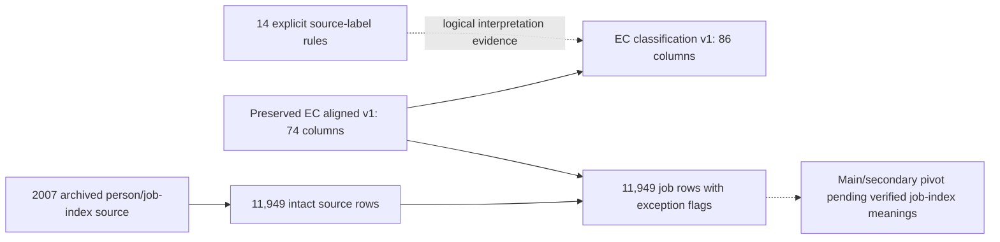

# Qualified EC classifications and 2007 job records

This additive contract preserves the [earlier corrected EC interface](cses-employment-corrected-interface.md)
and all original codes. It addresses explicit missing-code interpretation and makes the omitted
2007 job source available at its original person/job-index grain. It does not certify that job
indices 1 and 2 mean main and secondary jobs.

## Interfaces and statistical units

| Object in `cses_analysis` | Records | Columns | Unit and purpose |
| --- | ---: | ---: | --- |
| `cses_ec_classification_v1` | 332,903 | 86 | Member-wave; prior 74 columns plus six interpreted codes and six missing-code flags |
| `cses_ec_jobs_2007_source_v1` | 11,949 | 13 | Original person/job-index rows; raw code spelling and source-row provenance |
| `cses_ec_jobs_2007_v1` | 11,949 | 17 | Same job rows plus job-count diagnostics and an explicit interpretation limitation |
| `cses_ec_classification_rule_v1` | 14 | 10 | Wave/variable-specific embedded-label rules, including zero-observation rules |

These are not actual interview-respondent counts. The 2007 job records cover 10,174 person-wave keys
already present in EC. They do not add 10,174 new people to the database, and must not be added to
the EC member-record count. Multiple job rows mean a direct person-only join can duplicate EC rows.
Use the three-part `(survey_wave, person_id, q13b_ocid)` key for job-level work.

The physical source table is the 37th CSES physical relation, not an eighth core table. The 36
pre-existing physical relations and historical 22-entry storage registry remain unchanged. This
source table is tracked by its release, row-level source identifiers and the new graph artifact
node, not by an invented historical dataset registration.

## Missing-code correction

The six original `*_source_code` fields are untouched. New `*_interpreted_code` fields expose NULL
only for the following explicitly labelled codes. Six matching `*_is_explicit_labelled_missing`
flags are TRUE for these values, FALSE for other non-null values within the respective evidence
scope, and NULL outside that scope or when the original value is NULL. FALSE does not certify a
code as valid: unlabelled codes are still preserved.

| Wave | Field | Source code | Interpreted as NULL: cells |
| --- | --- | --- | ---: |
| 2004 | Main occupation | `999` | 136 |
| 2004 | Secondary occupation | `999` | 61 |
| 2004 | Main industry | `99` | 115 |
| 2004 | Secondary industry | `99` | 55 |
| 2004 | Main employer type | `99` | 310 |
| 2004 | Secondary employer type | `99` | 89 |
| 2019 | Main industry | `9990` | 2 |
| 2019 | Secondary occupation | `999` | 6 |
| Total | Field-cells, potentially overlapping in people | | 774 |

The complete 14-rule scope also records zero-observation 2019/2021 occupation `999` and industry
`9990` labels. Only explicit wave/variable labels authorize NULL interpretation; no global 99/999
rule is adopted. The 2021 rules currently affect zero stored cells.

| New interpreted field | Non-null member-wave records | Total EC records |
| --- | ---: | ---: |
| `main_occupation_interpreted_code` | 201,842 | 332,903 |
| `main_industry_interpreted_code` | 201,856 | 332,903 |
| `main_employer_type_interpreted_code` | 201,654 | 332,903 |
| `secondary_occupation_interpreted_code` | 56,497 | 332,903 |
| `secondary_industry_interpreted_code` | 56,507 | 332,903 |
| `secondary_employer_type_interpreted_code` | 56,475 | 332,903 |

These are non-null availability counts, not counts of valid substantive choices or eligible
respondents. They still include the 12 unlabelled code cells. None of these six fields is certified
for unrestricted comparison across all ten waves.

In particular, 2004 industry `00` means growing of cereals and other crops n.e.c. All 14,515 main-job
and 920 secondary-job occurrences remain substantive source codes. The 12 previously identified
unlabelled code cells remain unchanged, including 2019 industry `9999`; this code is not silently
converted to the labelled `9990`. Employer categories remain wave-specific, not a shared eight-code
classification. Earlier age, employment-status, recovered workday and hours qualifications are
preserved in all 74 inherited columns.

## 2007 recovery without an unsupported main/secondary pivot

The original `13B_mainoccupation.dta` contains 10,153 index-1 rows and 1,796 index-2 rows. All 11,949
rows link to existing EC people with the same household key. Person/job-index keys are unique.
The source table retains original `pkid`, `q13b_c01`, `q13b_ocid`, `q13bc02b` (occupation),
`q13bc03b` (industry), and `q13bc07` (employer) values. Occupation/industry strings are not padded
or recoded in this raw-source table. The 27 missing employer values remain NULL.

Every row retains `source_archive`, `source_member`, `source_row_id`, and `source_sha256`.
The companion job view adds:

- `total_occupations_past_7_days`: the unchanged EC count, not recomputed from the job rows.
- `index_exceeds_reported_job_count`: TRUE for 65 rows; these are retained, not suppressed.
- `index_2_without_index_1`: TRUE for 21 rows; no synthetic index-1 row is created.
- `job_index_interpretation`: always `unverified_primary_secondary_meaning`.

The 65 and 21 flags may overlap; they are not independent groups to be summed. Known-index/count
disagreement is an audit flag, not evidence about which original answer is correct. A missing
reported count would yield NULL for the comparison flag, not FALSE.

The companion 2007 employer dictionary has ten named categories, including code 7 = Self-employed
farm. Its relation to the raw variable is companion-codebook evidence rather than an embedded
Stata label assignment. The occupation companion `dbo_c_occu.dta` contains zero rows and cannot
establish job-index meanings. Neither dictionary certifies that job index 1/2 is primary/secondary.

The six 2007 main/secondary wide fields therefore remain NULL, including in the new classification
view. The source omission is repaired at the source-job layer; the main/secondary pivot is explicitly
pending a verified job-index contract. No questionnaire options or routes are borrowed from 2004
or 2016 to close that gap.

## How to query

For interpreted member-level codes, use the new fields explicitly:

```sql
SELECT survey_wave,
       count(*) AS member_records,
       count(main_occupation_interpreted_code) AS occupation_nonnull,
       count(*) FILTER (WHERE main_occupation_is_explicit_labelled_missing) AS labelled_missing
FROM cses_analysis.cses_ec_classification_v1
GROUP BY survey_wave
ORDER BY survey_wave;
```

For the recovered 2007 source, retain its job-index grain:

```sql
SELECT q13b_ocid AS source_job_index,
       count(*) AS job_records,
       count(q13bc07) AS employer_nonnull,
       count(*) FILTER (WHERE index_exceeds_reported_job_count) AS count_conflicts,
       count(*) FILTER (WHERE index_2_without_index_1) AS absent_index_1
FROM cses_analysis.cses_ec_jobs_2007_v1
GROUP BY q13b_ocid
ORDER BY q13b_ocid;
```

Do not rename the second query's rows to main/secondary or filter away exceptions without an
explicit analysis rule. Do not compute labour-force rates from these availability counts: the
earlier questionnaire age/skip limitations, missing weights and unverified waves still apply.

## Topology and reproducibility



The database dependencies are OLD → NEW, SOURCE → JOBS and OLD → JOBS. The rule and pending-pivot
links are explanatory, not SQL joins. Graph v14 preserves every v13 node and edge; its new source
artifact is explicitly unregistered in the historical dataset catalog.

- [Publication evidence and checksums](releases/cses-employment-classification-qualified-v1.md)
- [Preserved classification review](cses-employment-classification-alignment.md)
- [Current interpreted EC Parquet](../data/processing/cses/employment_classification_corrected_v1/final_EC_CSES.parquet)
- [Original job-source Parquet](../data/processing/cses/employment_classification_corrected_v1/jobs_2007_source.parquet)
- [Job-view Parquet](../data/processing/cses/employment_classification_corrected_v1/jobs_2007.parquet)

This correction adds no newly reviewed fields: employment review coverage remains 17 of 39, with
22 remaining. It publishes neither an all-wave classification crosswalk nor an all-wave comparability
certification. Git commits and DVC archival are separate operations and are not implied.
