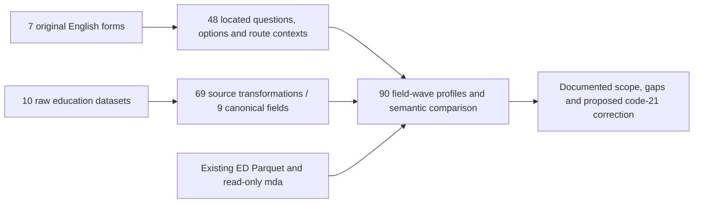

# CSES education alignment brief

Local evidence review; no new database publication or data correction.

The education table has **343,204 member-wave records and 30 physical fields**. Nine fields concern education (seven source question families and two derived levels); the other 21 are identities, demographic/context or provenance fields. This review covers 69 available direct source-field/wave pairs, 48 question correspondences in seven English forms, and all 90 education-field/wave profiles. The 2014 form is a draft. Actual directly interviewed respondent counts remain unknown.

## New mapping conflict: current postgraduate studies

The 2013, 2014 and 2016 English forms label **current-level source code 21 as Postgraduate studies**, but the inherited builder maps it to **7=Other**. The proposed interpretation is **6=Higher education**. This is a proposed correction, not a change applied by this review. Highest-completed code 21 is Other and must not be changed with it.

| Wave | Current-level code 21 records | Confirmed current attendance | Existing group | Evidence boundary |
| --- | ---: | ---: | --- | --- |
| 2013 | 6 | 6 | 7=Other: 6 | English form checked |
| 2014 | 18 | 18 | 7=Other: 18 | 2014 draft only |
| 2016 | 6 | 6 | 7=Other: 6 | English form checked |
| 2017 | 8 | 8 | 7=Other: 8 | No household form: do not transfer the meaning |

The 30 questionnaire-supported candidate rows comprise 12 from 2013/2016 and 18 from the 2014 draft. The additional eight 2017 rows are a separate unresolved scope. Neither group is silently corrected. The released 2017 education file has no embedded value-label sets to independently establish code 21. In 2021, current-level code 20 means Other, whereas highest-completed code 20 means Doctorate; current and completed-level dictionaries must remain separate.

## What is aligned, and what still needs a decision?

| Field family | Verified scope | Remaining boundary |
| --- | --- | --- |
| can_read / can_write | Same simple-message-in-any-language questions; 1=Yes / 2=No in all seven forms; existing 1/0 transformations reproduced | Five-plus universe in 2004, three-plus later; respondent/proxy protocols vary; three form gaps remain |
| ever_attended_school / currently_attending_school | Fourteen question-wave records; two choices each; explicit No skips and holiday inclusion checked | Current attendance is downstream of ever-attendance; no automatic zero imputation or universal denominator |
| years_attended_school | Six printed questions ask completed years attended; absent in 2004 | Numeric, not a fixed option list; 0–30 is an inherited cleaning rule, not a printed maximum; not equivalent to highest completed grade |
| highest_education_level_source_code / education_level_harmonized | Seven full grade/code lists, unknown code 98 and none/no-class codes 90 versus 88 checked | Broad grouping collapses grades, certificates and incomplete undergraduate study; exact educational attainment is not established by the broad label |
| current_education_level_source_code / current_education_level_harmonized | Seven current-level lists compared separately from completed attainment | Confirmed code-21 mapping conflict; further values absent from printed lists require separate evidence; 2014 remains provisional |

No education field receives unrestricted all-ten-wave analytical certification from this batch. The questionnaire correspondence, literal options and routing are now documented for the inspected forms; no question link has been inserted into PostgreSQL.

## Denominators and eligibility

| Wave | ED records | Printed minimum age | At/above minimum | Below minimum | Missing age | Unmatched HL |
| --- | ---: | --- | ---: | ---: | ---: | ---: |
| 2004 | 74,719 | 5 | 67,452 | 7,266 | 1 | 0 |
| 2007 | 15,789 | Not verified | Not inferred | Not inferred | 0 | 0 |
| 2009 | 53,647 | 3 | 53,647 | 0 | 0 | 0 |
| 2011-12 | 15,469 | 3 | 15,469 | 0 | 0 | 0 |
| 2013 | 16,389 | 3 | 16,388 | 0 | 1 | 1 |
| 2014 | 51,221 | 3 | 51,218 | 0 | 3 | 3 |
| 2016 | 16,093 | 3 | 16,092 | 1 | 0 | 0 |
| 2017 | 16,110 | Not verified | Not inferred | Not inferred | 0 | 0 |
| 2019 | 42,308 | Not verified | Not inferred | Not inferred | 0 | 0 |
| 2021 | 41,459 | 3 | 41,459 | 0 | 0 | 0 |

Age-eligible records are not automatically actual respondents or final analysis denominators. The four unmatched education rows remain present, with unavailable inherited ages. 2004 includes roster rows below the printed five-year threshold; the release is preserved. All nine education fields are NULL for its 7,266 known under-five records. 2016 contains one age-two record despite a three-plus instruction; do not delete or alter it by inference.

Respondent instructions differ: 2004 requests members age five-plus; 2009 names the head, spouse or another adult; 2011-12 onward requests members age three-plus, asks parents for ages three to six and permits proxy interviews for absent people. The respondent-ID item appearing in later forms is outside the nine canonical education fields and is not counted as a new aligned variable.

Literal routing: No to ever-attended skips to question 10 in 2004 or 11 later, bypassing years, completed level and current attendance. No to current attendance skips current level. School holidays still count as being in the school system. Recorded values outside these routes are diagnostic counts, not automatic proof of erroneous answers. Structural skips, released blanks, unknown code 98 and invalid codes are not interchangeable.

There are 17 records reporting current attendance Yes while ever-attended is No (2014: 9; 2016: 7; 2021: 1). Retain and flag them; the literal-route denominators exclude them without rewriting stored answers. The 2004 release also uses 9 in the four Yes/No fields (216 field cells) and 99 in completed/current level (67 and 15 records). These codes are absent from the inspected printed option lists; the existing processing keeps detailed level source codes but sets the corresponding harmonized values to NULL. These are overlapping field counts, not 298 unique respondents, and their raw missingness reasons are not inferred.

## Available values and literal-route counts

The [90-cell profile](cses-education-field-wave-review.md) gives each field's non-null count, age/route-restricted non-null count and observed routing exceptions by wave. These are unweighted counts. 2004 lacks general person/household weights. No rates or pooled estimates are certified here.

## Evidence, topology and reproducibility

This local dependency diagram does not replace the published database lineage graph v11.

Original workbook bytes and all extracted sheets were independently rechecked with macro-disabled legacy conversion. All seven raw source fields were compared row-by-row with existing ED outputs wherever present, and the two existing derived mappings were replayed. The latter proves reproduction, not semantic correctness. A separate read-only database transaction compared all 343,204 rows and 30 fields against the local artifact: 29 fields match exactly; source_archive matches after the established comparison-only prefix relocation from data/raw/CSE/ to data/raw/. Database paths are not rewritten. Reports retain aggregates and source hashes only, not individual records.

- [Complete literal options, locators, raw code frequencies and review results](../data/processing/cses/education_review_v1/review.json)
- [Original population brief snapshot](cses-variable-brief.md)
- [Previously prepared question-link batch](cses-questionnaire-batch-plan.md)

To reproduce, first run `review_cses_education.py --verify-workbooks --soffice /path/to/bundled/soffice` with the bundled Python runtime, then run `.venv/bin/python rsc/cses_db/review_cses_education.py --check-database`. Use a fresh `--output` directory for a changed snapshot. Original review packages, builders, source data and published interfaces are not rewritten.

## Next bounded decisions

1. Review the code-21 correction scope separately: 12 records supported by non-draft forms, 18 by the 2014 draft, and eight unresolved 2017 records.
2. Register the 2004 released 9/99 code qualifications separately from the printed unknown code 98, and retain the 17 contradictory attendance records as diagnostics.
3. Recover/transcribe the three remaining household-form gaps before certifying all-wave comparability; continue EC review independently.

Spreadsheet review guidance informed literal-source preservation, complete option lists and the separation of eligibility from observed records. Project Python handles Parquet/Stata/database verification; no source workbook is edited or authored.
