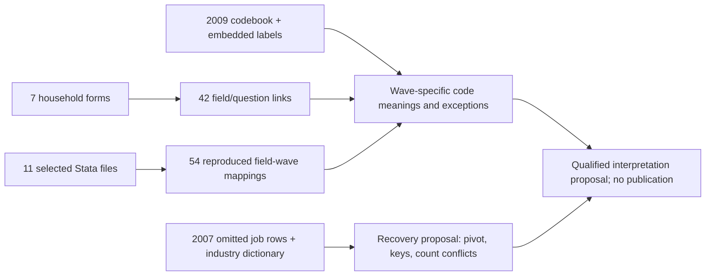

# CSES occupation, industry and employer type

This third EC batch reviews six fields across 332,903 member-wave records. Cumulative review coverage is 17 of 39 employment fields, with 22 remaining. None of the six is certified as unrestrictedly comparable across all ten waves. Source correspondence is not a common classification crosswalk. The original table, current corrected interface and published graph v13 are unchanged.

## Variables and available records

Counts are unweighted records, not actual interview respondents or longitudinal people. Non-null codes can still mean missing/not stated. Removing only explicit labelled missing codes does not certify the remaining codes as valid.

| Field | Non-null | Explicit labelled missing/not stated | Remaining non-null | Response type |
| --- | ---: | ---: | ---: | --- |
| `main_occupation_source_code` | 201,978 | 136 | 201,842 | Coded description; not a fixed questionnaire choice list |
| `main_industry_source_code` | 201,973 | 117 | 201,856 | Coded description; not a fixed questionnaire choice list |
| `main_employer_type_source_code` | 201,964 | 310 | 201,654 | 10 employer choices in 2004; 8 in six later forms |
| `secondary_occupation_source_code` | 56,564 | 67 | 56,497 | Coded description; not a fixed questionnaire choice list |
| `secondary_industry_source_code` | 56,562 | 55 | 56,507 | Coded description; not a fixed questionnaire choice list |
| `secondary_employer_type_source_code` | 56,564 | 89 | 56,475 | 10 employer choices in 2004; 8 in six later forms |

## Main findings

1. **Employer categories change.** 2004 has 10 printed categories; inspected 2009–2021 forms have eight. Code 7 changes from self-employed farm to embassies/international institutions/foreign aid, and code 8 from non-farm self-employed to Other. Do not pool identical numbers. In 2004 the Stata label for code 7 says farm worker, whereas the questionnaire says self-employed farm. Both wordings are retained, not silently reconciled. Employer type is distinct from employment status.
2. **Classification codes need wave-specific dictionaries.** Occupations are padded to a minimum of three digits; industry to two in 2004 and four later. Padding preserves leading zeros and does not truncate longer codes. It is not a classification conversion. The newly inspected original `CSES2009 ISCO and ISIC Codes.xls` provides named 2009 code lists, but its sheet titles do not state revision numbers. An unheaded Sheet3 is retained separately, not silently merged. We do not infer a universal ISCO/ISIC revision from code patterns.
3. **774 retained field-cells explicitly mean missing/not stated.** The original 2004 labels identify occupation 999, industry 99 and employer 99 as missing. 2019/2021 labels identify occupation 999 and industry 9990 as not stated. These remain raw codes in the current interface. A separate qualified overlay is the next bounded correction, not automatic deletion. Field-cell counts may overlap in people.
4. **2007 has an omitted long-format job source.** `13B_mainoccupation.dta` contains 11,949 job rows for 10,174 people. All link to EC with matching household keys, and person/job-index keys are unique. It is outside the original builder selection, which explains the six all-NULL canonical fields. Job indices 1/2 suggest primary/secondary rows but are not independently questionnaire-certified. There are 21 people with index 2 but no index 1. A pivot, source-row lineage and explicit treatment of job-count conflicts are needed before recovery; no values are filled here.

**Do not treat every zero or unusual code as missing.** In 2004, industry `00` is explicitly labelled growing of cereals and other crops n.e.c.: 14,515 main-job and 920 secondary-job cells. These are substantive source codes, not NULL candidates. A further 12 retained cells in 2019/2021 have no corresponding embedded label (listed in the detail report); their meanings remain unresolved. In particular, unlabelled industry 9999 is not automatically the labelled 9990 not-stated code.

## Evidence and denominators

Seven English household forms were freshly re-extracted with macros disabled, all sheets compared with frozen cells. 42 field/question correspondences map to 39 distinct printed items because 2004 repeats primary/secondary job rows. The 2009 printed subsection A / released variable subsection C difference is explicitly located. 54 existing raw field-wave transformations and their job-count dependencies were reproduced from 11 Stata sources, including fresh labels.

Printed eligibility is age 10+ in 2004 and 5+ in inspected later forms. For 2004, the literal Part B route requires job count at least one/two. For later inspected forms, main details accept first OR second work screen Yes; secondary details additionally require at least one additional job. These routes are diagnostics, not a newly certified labour-force denominator. The inherited cleaner suppresses secondary details for known job counts below two, but not for unknown counts. The 2014 form remains a draft; 2007/2017 household forms are unverified, and 2019 image-form transcription is pending. 2019 embedded code labels do not establish its missing questionnaire routes. Two unmatched HL records remain; 2004 general sampling weights are unavailable.

| Wave | EC records | Any of six non-null | All six non-null | Unmatched HL |
| --- | ---: | ---: | ---: | ---: |
| 2004 | 74,719 | 42,629 | 7,555 | 0 |
| 2007 | 15,766 | 0 | 0 | 0 |
| 2009 | 51,460 | 35,202 | 13,829 | 0 |
| 2011-12 | 14,829 | 10,105 | 3,663 | 0 |
| 2013 | 15,774 | 9,950 | 2,499 | 0 |
| 2014 | 49,252 | 31,281 | 7,441 | 1 |
| 2016 | 15,498 | 10,151 | 2,541 | 1 |
| 2017 | 15,482 | 10,088 | 2,437 | 0 |
| 2019 | 40,379 | 26,753 | 8,827 | 0 |
| 2021 | 39,744 | 25,823 | 7,766 | 0 |

All-six completeness is not a recommended sample: many people do not have a secondary job.

[Detailed field-wave counts, option lists, source cells and recovery diagnostics](cses-employment-classification-field-waves.md) and the [aggregate evidence snapshot](../data/processing/cses/employment_classification_review_v1/review.json) retain the audit trail.

A forced read-only database transaction matched all selected values in both the original EC table and current corrected EC view: 332,903 records and 17 columns per relation. This is a selected-column comparison, not a full relation validation.

This is a local review topology, not a new database graph. Published graph v13 and all earlier release/review snapshots remain frozen. Spreadsheet guidance informed code-column/description pairing, literal option checks and preservation of original observations.

Reproduce using the bundled runtime: `rsc/cses_db/review_cses_employment_classification.py --verify-workbooks --soffice /path/to/bundled/soffice`, then `.venv/bin/python rsc/cses_db/review_cses_employment_classification.py --check-database`. Changed snapshots require fresh `--output` / `--docs-dir`. No Git/DVC push or database publication is implied.

Next resolve the scoped labelled-missing overlay and the 2007 source-grain/gate recovery contract. Do not publish an all-wave classification crosswalk without authoritative wave-specific classification evidence.
