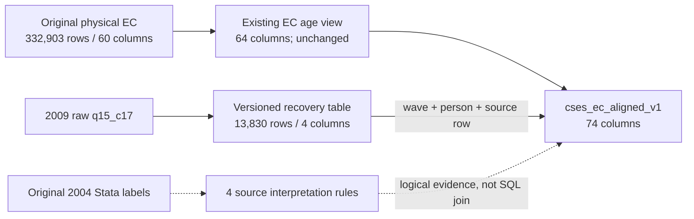

# Corrected CSES employment analysis interface

Use `cses_analysis.cses_ec_aligned_v1` for the approved secondary-days recovery and qualified
employment-status/hour interpretations. The [publication record](releases/cses-employment-recovery-qualified-v1.md)
contains the execution and independent validation evidence.

The unchanged `cses_data."final_EC_CSES"`, `public."final_EC_CSES"` and
`cses_analysis.cses_ec_age_v1` retain their historical values. They are not redirected. The new
interface preserves all 332,903 member-wave records, including two unmatched HL records, and has
74 columns: 64 inherited age-qualified columns plus ten interpretation/provenance columns.

## Exact published interpretation

| Scope | Result in the new interface | Original evidence retained |
| --- | --- | --- |
| 2009 secondary workdays | Fill 13,830 previously NULL values from original `q15_c17` | Original NULL field, recovery version, source row identity and source rule |
| 2004 main-job status 9 | NULL in `main_employment_status_interpreted`, 185 cells | Original source-code field still 9; labelled-missing flag |
| 2004 secondary-job status 9 | NULL in `secondary_employment_status_interpreted`, 71 cells | Original source-code field still 9; labelled-missing flag |
| 2004 total hours 96 | Six records qualified as 96+; lower bound 96 and exact hours NULL | Original total-hours value still 96 |

The 256 status cells can overlap in people; they are not 256 extra respondents. No other status
codes are recoded, and no missing or top-code meaning is transferred to another wave. The
interpreted status columns otherwise pass through the original codes; they are not a newly
certified common category dictionary. All three pre-existing 2004 age-96+ records keep their age
qualifications. Age and weekly-hours topcoding are different rules and are not assumed to identify
the same people.

The 2009 recovery uses source variable 989, with the same-wave question at
`15 Econo_Status_2!G4` / printed code `G16` / unit `G15`. The original alias list omitted `q15_c17`.
Recovered values pass the inherited integer 0–31 and secondary-job checks. They are not imputed
from another field or wave. No non-null canonical day value is overwritten.

## Ten added columns

| Column | Contract |
| --- | --- |
| `secondary_days_before_recovery` | Original secondary-days value on every row |
| `secondary_days_recovery_version` | `cses-employment-recovery-qualified-v1` on the 13,830 recovered rows; NULL otherwise |
| `main_employment_status_interpreted` | Original main-job code except the 185 labelled-missing 2004 values become NULL |
| `secondary_employment_status_interpreted` | Original secondary-job code except the 71 labelled-missing 2004 values become NULL |
| `main_status_2004_is_labelled_missing` | 2004 only: true for raw 9, false for other observed codes; NULL for missing source or other waves |
| `secondary_status_2004_is_labelled_missing` | Same rule for the secondary job |
| `total_hours_2004_is_topcoded` | 2004 observed 0–96 only: true for 96, false below 96; NULL otherwise |
| `total_hours_2004_lower_bound` | 2004 reported hours below 96, or lower bound 96 for top-coded records; NULL otherwise |
| `total_hours_2004_exact` | 2004 reported hours below 96; NULL for 96+, missing source, other waves or unexpected codes |
| `total_hours_2004_status` | `reported_hours`, `topcoded_96_plus`, `missing_hours`, `outside_rule_scope`, or guarded `unexpected_2004_code` |

Filtering on `total_hours_2004_exact` alone excludes the top-coded group and all other waves.
Do not use it as a universal hours variable. The original weekly-hours column is unchanged.

## Supporting objects and lineage

`cses_analysis.cses_ec_secondary_days_recovery_v1` is a versioned auxiliary physical table with
13,830 rows and four columns: `survey_wave`, `person_id`, `secondary_days_worked_last_month` and
`source_row_id`. Its primary key is `(survey_wave, person_id)`; constraints restrict the wave to
2009 and the day values to 0–31, with no NULL keys or values. The analysis view joins on wave,
person and original source-row identity, so mismatched source rows cannot silently receive values.

`cses_analysis.cses_ec_correction_rule_v1` exposes four rule rows and 17 columns, with original
source-variable IDs, data-file paths and hashes, questionnaire paths and hashes, sheet/cell,
embedded value labels, affected counts, release ID, review hash and qualifications. Missing-code
and top-code interpretations rely on the original Stata labels, not a guessed questionnaire option.

The auxiliary table belongs to this analysis-interface release. It is not an eighth core table or
a replacement canonical release. The historical 22-entry storage registry, 280-field canonical
catalog, question links and mapping/load-run history are unchanged. Auxiliary-table provenance is
recorded in the four-rule interface, hash-bound execution manifest and explicit graph extension;
do not count it as one of the historical registered storage relations.



The [corrected Parquet](../data/processing/cses/employment_corrected_v1/final_EC_CSES.parquet) matches
the new view. The [recovery Parquet](../data/processing/cses/employment_corrected_v1/secondary_days_recovery.parquet)
matches the auxiliary table. Both are separate from the frozen baseline. Local archive paths use
current repository-relative names; historical database archive prefixes are normalized for equality
comparisons only. Individual records are not copied into the documentation or execution reports.

## Query examples

```sql
SELECT survey_wave, count(*) AS recovered_records
FROM cses_analysis.cses_ec_aligned_v1
WHERE secondary_days_recovery_version IS NOT NULL
GROUP BY survey_wave;

SELECT count(*) FILTER (WHERE main_status_2004_is_labelled_missing) AS main_missing,
       count(*) FILTER (WHERE secondary_status_2004_is_labelled_missing) AS secondary_missing,
       count(*) FILTER (WHERE total_hours_2004_is_topcoded) AS hours_topcoded,
       count(*) FILTER (WHERE age_2004_is_topcoded) AS age_topcoded
FROM cses_analysis.cses_ec_aligned_v1;

SELECT rule_id, source_variable_id, rule_kind, affected_cells_or_records, source_value_label
FROM cses_analysis.cses_ec_correction_rule_v1
ORDER BY rule_id;
```

## Retained limitations and next work

This release handles only the three approved issues, represented by four field-specific rules.
It does not resolve the 2,412 hours-reconciliation inconsistencies, unlabelled hourly 98/99
exclusions, the 2007 missing job-detail aliases or the 2007/2017/2019 household-form gaps. The 2014
draft remains provisional. The differing screening definitions and the printed Q11-to-Q20 skip
still limit pooled analysis. No new employment/unemployment rate definition, weighting rule or
analytic sample is adopted.

The [hours/status review](cses-employment-hours-status-alignment.md), its
[field-wave profiles](cses-employment-hours-status-field-waves.md), and the
[screening review](cses-employment-screening-alignment.md) remain preserved pre-publication
snapshots. Their historical missing-value counts describe the original interface. The new view
has 13,830 fewer NULL secondary-days cells; the two interpreted status fields have 185 and 71
more NULLs than their preserved source-code counterparts.

| Wave and field | Non-null in preserved source/baseline | Non-null in new analysis field |
| --- | ---: | ---: |
| 2009 secondary workdays | 0 | 13,830 |
| 2004 main-job status | 42,629 source codes | 42,444 interpreted codes |
| 2004 secondary-job status | 7,555 source codes | 7,484 interpreted codes |
| 2004 total weekly hours | 42,957 recorded values | 42,951 exact values plus six lower-bound-only values |

These differences describe completeness, not a new analysis sample. In particular, the six top-coded
records still have valid lower bounds and must not disappear merely because their exact values are NULL.

EC review coverage remains 11 of 39 employment fields, with 28 awaiting later batches. Publishing
these corrections does not certify those 11 fields as fully comparable across ten waves. The next
new batch is occupation, industry and employer type; unresolved hours discrepancies remain a
separate source-diagnosis queue.

## Verification and recovery boundary

The publisher checks every projected value against an independently reconstructed local frame,
all recovery rows and rules, reader access, historical table fingerprints and prior interfaces.
Publication uses a verified private schema-only backup and a full rollback rehearsal before the
single committed transaction. No existing object is replaced, and the only inserted physical rows
belong to the new auxiliary table. The number of physical CSES relations rises from 35 to 36.

```bash
.venv/bin/python rsc/cses_db/publish_cses_employment_correction.py validate
.venv/bin/python rsc/cses_db/publish_cses_employment_correction.py export
```

Earlier validators intentionally freeze their historical table/view scope and may reject the new
objects. Do not weaken or rewrite them; use this release's validator for the expanded state.
Removal or restoration requires a separately scoped recovery decision. The auxiliary rows can be
reproduced from the original archived Stata source, but a schema-only backup is not a respondent-data
backup. Git/DVC archival is a separate workflow and is not implied by database publication.
