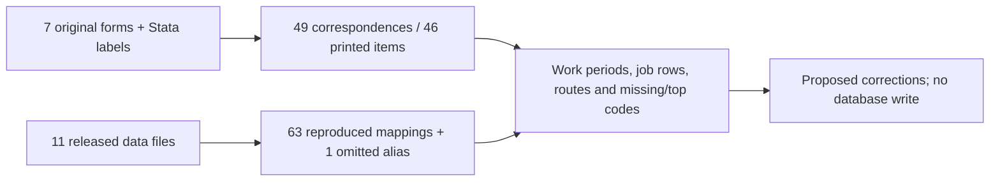

# CSES employment hours, workdays and status

This second EC batch reviews seven fields across 332,903 member-wave records. Together with the [screening batch](cses-employment-screening-alignment.md), 11 of 39 employment fields have now been examined; 28 remain outside these batches. Reviewed does not mean fully comparable: **none of these seven fields is certified across all ten waves**. The original 60-column EC table, baseline Parquet and database catalog are unchanged.

## Fields and response types

| Field | Recorded quantity | Printed choices |
| --- | --- | --- |
| `total_hours_worked_past_7_days` | Weekly hours | Numeric entry, not a fixed-choice question |
| `main_hours_worked_past_7_days` | Weekly hours | Numeric entry, not a fixed-choice question |
| `secondary_hours_worked_past_7_days` | Weekly hours | Numeric entry, not a fixed-choice question |
| `main_days_worked_last_month` | Workdays in past month | Numeric entry, not a fixed-choice question |
| `secondary_days_worked_last_month` | Workdays in past month | Numeric entry, not a fixed-choice question |
| `main_employment_status_source_code` | Employment status for the named job | Five categories, 1–5, in all seven inspected forms |
| `secondary_employment_status_source_code` | Employment status for the named job | Five categories, 1–5, in all seven inspected forms |

Status labels are Employee (Paid employee in 2004), Employer, Own account worker/self-employed, Unpaid/contributing family worker, and Other. Exact wording is retained in the evidence. This is a job-level status, not employer ownership and not a labour-force classification. Fresh 2019 Stata labels separately support its five status codes, but do not establish missing household-form routes. The 2014 draft remains provisional; 2007/2017 lack verified household forms and the 2019 image-form transcription remains pending.

## Findings requiring a follow-up release

1. **2009 secondary workdays were not mapped.** Original `q15_c17` (source variable 989) contains 13,830 non-null values. All 13,830 remain eligible after the existing numeric and secondary-job rules. The canonical field is entirely NULL because its alias list omits `q15_c17`. The questionnaire locates the item at `15 Econo_Status_2!G4/G16`, unit `G15`. This is a missing mapping, not evidence that the question was not collected. The recovery is proposed only; no values were filled.
2. **2004 status code 9 is labelled missing in the original Stata files.** It remains as a raw code in 185 main-job and 71 secondary-job canonical cells. It must not be treated as a sixth employment category. These are field-cell counts that may overlap in people; a future qualified analysis overlay can expose NULL while preserving original codes.
3. **2004 total-hours code 96 means 96 or more hours**, according to its fresh Stata value label. There are 6 such records. Preserve 96 as the lower bound; exact weekly hours are unknown. Do not read these as exactly 96 or as an ordinary missing code. The existing table has not yet gained a hours-topcode qualifier.
4. The inherited hourly cleaner drops 98/99 in every wave. Only wave/variable-specific labels establish their meanings. Located hour-question cells do not document a universal 98/99 convention. The detail report shows the affected raw codes; do not automatically restore or reinterpret unlabelled values.

Three-field hours reconciliation also finds total below main plus secondary in 1,798 records in 2004, 310 in 2019 and 304 in 2021, after excluding the identified top-coded totals. These 2,412 inconsistencies need source-level follow-up; no component is overwritten and no cause is inferred here.

## Population, routing and interpretation

Printed eligibility is age 10+ in 2004 and 5+ in the six inspected later forms. Age/route rules are unknown for 2007/2017/2019, not borrowed from neighbours. These counts are unweighted table records, not actual interview respondents.

- 2004 repeats three Part B columns in primary and secondary job rows. Six source variables map to three printed items, with `C43=1º` / `C44=2º` and `_1` / `_2` suffixes retaining the job identity.
- Main-job hours and monthly days in the inspected 2009–2016 forms require first-screen Yes. The 2021 gate accepts first OR second screen Yes, including the unpaid-work branch.
- In inspected 2009–2021 forms, Q11=0 skips to Q20, bypassing the secondary-job block **and Q19 total hours**. Hence the literal Q19 route is not all workers. Released values outside this printed route are retained and counted. Do not substitute main hours for missing total hours without an explicit derivation rule.
- Existing cleaning removes secondary-job values when the canonical number of occupations is known to be below two. Unknown job counts do not trigger that suppression. Its raw count and main-occupation dependencies were reproduced; their broader semantics are not newly certified.
- Total weekly hours may include jobs beyond the main and secondary job. A positive difference is not automatically an error. The reconciliation requires all three values and excludes 2004 top-coded totals; missing components are not replaced with zero.

| Wave | EC records | Any of seven non-null | All seven non-null | Unmatched HL |
| --- | ---: | ---: | ---: | ---: |
| 2004 | 74,719 | 43,166 | 7,475 | 0 |
| 2007 | 15,766 | 10,173 | 0 | 0 |
| 2009 | 51,460 | 35,202 | 0 | 0 |
| 2011-12 | 14,829 | 10,105 | 3,643 | 0 |
| 2013 | 15,774 | 9,950 | 2,483 | 0 |
| 2014 | 49,252 | 31,281 | 7,434 | 1 |
| 2016 | 15,498 | 10,151 | 2,540 | 1 |
| 2017 | 15,482 | 10,088 | 2,397 | 0 |
| 2019 | 40,379 | 26,751 | 8,810 | 0 |
| 2021 | 39,744 | 25,821 | 7,760 | 0 |

All-seven completeness is a diagnostic, not a recommended analysis sample: secondary fields are structurally inapplicable for many records. The 2007 selected source does not provide six job-detail aliases; those fields remain NULL, without claiming no other archive could contain related information. 2004 general sampling weights remain unavailable.

## Evidence and verification

[Field-wave denominators and source locators](cses-employment-hours-status-field-waves.md) include original non-null counts, numeric-cleaning exclusions, secondary suppression, literal-route diagnostics and exact printed option cells. [Machine-readable review](../data/processing/cses/employment_hours_status_review_v1/review.json) retains original labels, 49 field/question correspondences (46 distinct printed items), 70 profiles and source hashes. Seven original questionnaires were freshly re-extracted, all sheets compared with frozen cells, and original Stata labels re-read. All 63 existing raw-field mappings were reproduced, alongside the separately proposed missing 2009 alias.

A forced read-only database comparison matched all selected values across 332,903 records and 16 columns (seven reviewed fields plus nine identity/context/dependency columns). This is not a full 60-column validation.

This local review topology does not modify published database graph v12. Earlier screening/education reviews and publishers remain frozen. Spreadsheet guidance informed unit checks, repeated-row mapping and preservation of raw observations.

Reproduce original-workbook verification using the bundled runtime with `rsc/cses_db/review_cses_employment_hours_status.py --verify-workbooks --soffice /path/to/bundled/soffice`, then run `.venv/bin/python rsc/cses_db/review_cses_employment_hours_status.py --check-database`. Use a fresh `--output` and `--docs-dir` for a changed review snapshot. No Git/DVC archival is implied.

Next prepare a bounded correction proposal for the omitted 2009 alias, 2004 labelled missing status and 2004 hours topcoding. Occupation/industry and employer type follow as the next new field batch. No physical-data or metadata publication occurs in this review.
