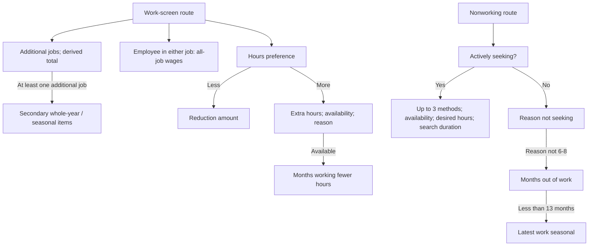

# Employment review: final 19 fields

**All 39 of 39 EC business fields have now received a detailed review. No fields remain unreviewed in this scope.** This finishes the review queue, not all corrections or unrestricted cross-year harmonization. The physical employment table and current classification view retain their existing values.

This batch covers 19 fields across 10 waves (190 field-wave profiles), 154 direct/derived source mappings and 111 complete question-to-field-wave correspondences. Shared method slots and derived total-count correspondences are not separate printed questions. Seven original English household workbooks were freshly verified sheet by sheet.

## Variables and available records

The EC table has 332,903 member-wave records. Below, non-null values measure field availability, not interview respondents. Do not add these counts across fields. See the [field-wave brief](cses-employment-remaining-field-waves.md) for every year, option set, route count and source locator.

| Field | Non-null values | Complete-question waves | Historical cleaner exclusions | Count-suppressed |
| --- | ---: | ---: | ---: | ---: |
| additional_jobs_count | 159,311 | 6 | 0 | 0 |
| total_occupations_past_7_days | 233,621 | 7 | 0 | 0 |
| secondary_job_works_whole_year | 35,103 | 5 | 1 | 11 |
| secondary_job_was_usual_past_7_days | 13,592 | 5 | 4 | 3 |
| monthly_salary_wages_riel | 79,868 | 6 | 0 | 0 |
| preferred_hours_change_source_code | 159,310 | 6 | 0 | 0 |
| hours_less_preferred | 916 | 5 | 0 | 0 |
| hours_more_preferred | 2,038 | 5 | 0 | 0 |
| available_for_additional_work | 4,507 | 6 | 1 | 0 |
| reason_working_fewer_hours_source_code | 4,507 | 6 | 0 | 0 |
| months_working_fewer_hours | 1,651 | 5 | 31 | 0 |
| job_search_method_1_source_code | 973 | 7 | 0 | 0 |
| job_search_method_2_source_code | 606 | 7 | 0 | 0 |
| job_search_method_3_source_code | 203 | 7 | 0 | 0 |
| desired_weekly_hours | 29,425 | 7 | 263 | 0 |
| months_actively_seeking_work | 294 | 5 | 11 | 0 |
| reason_not_actively_seeking_source_code | 82,736 | 6 | 0 | 0 |
| months_out_of_work | 1,267 | 5 | 346 | 0 |
| latest_work_seasonal | 1,205 | 5 | 4 | 0 |

## Findings requiring follow-up

1. **Secondary seasonality is misnamed.** `secondary_job_was_usual_past_7_days` asks whether the secondary work is seasonal in the five inspected 2011+ forms. Raw 1/2 → stored 1/0 is correct. A future additive alias should preserve the old field and explicitly qualify 2017/2019 evidence, just as for main-job seasonality.

2. **Explicit special codes remain in old numeric columns.** In 2004, 244 total-occupation values of 9 and four first-search-method values of 9 are labelled missing. Second/third search slots also retain 293/105 zeros labelled no more ways recorded. These 398 zeros are empty slots, not extra search categories. The count-9 issue matters to downstream secondary-job eligibility; do not simply recode it and rebuild historical tables without a separate impact review.

3. **Earlier related source columns are omitted, with important qualifications.** The selected 2004 archive contains job-specific wages and a differently coded hours preference; the 2007 selected source contains related preference, non-seeking reason and duration columns but lacks a verified household form. The 2009 source contains a combined hours-change column and separate month/year fields. Their presence does not authorize treating them as equivalent to later canonical columns.

4. **2009 duration evidence conflicts with observed year values.** The form prints MONTHS and YEARS for 25a/b and 30a/b, but the data year components contain calendar-like years such as 2008 and 2009. Neither multiplying the year by 12 nor subtracting it from interview year is justified yet. Keep the components separate until their intended meaning is confirmed.

5. **Known cleaning and route exceptions are now explicit.** The inherited secondary-count rule removes 11 whole-year and three seasonal responses in 2021. Later month-duration 98 codes have embedded unknown labels; 2021 questions 25/30 print that instruction too. One excluded 2019 out-of-work value of 99 lacks an explicit label. Two stored 2019 non-seeking reason zeros are outside the verified 1–9 dictionary. These findings do not justify silently imputing or deleting answers.

## Earlier source candidates (not imported)

| Wave | Source variable | Non-null source records | Current disposition |
| --- | --- | ---: | --- |
| 2004 | q13a06 | 43,166 | Retained in original archive; no canonical fill |
| 2004 | q13a11a | 6,764 | Retained in original archive; no canonical fill |
| 2004 | q13a11b | 6,764 | Retained in original archive; no canonical fill |
| 2004 | q13b08_1 | 8,844 | Retained in original archive; no canonical fill |
| 2004 | q13b08_2 | 867 | Retained in original archive; no canonical fill |
| 2007 | q13ac06 | 10,166 | Retained in original archive; no canonical fill |
| 2007 | q13ac09 | 5,588 | Retained in original archive; no canonical fill |
| 2007 | q13ac10 | 5,451 | Retained in original archive; no canonical fill |
| 2007 | q13ac13a | 496 | Retained in original archive; no canonical fill |
| 2007 | q13ac13b | 406 | Retained in original archive; no canonical fill |
| 2009 | q15_c22 | 3,051 | Retained in original archive; no canonical fill |
| 2009 | q15_c25a | 1,758 | Retained in original archive; no canonical fill |
| 2009 | q15_c25b | 1,630 | Retained in original archive; no canonical fill |
| 2009 | q15_c30a | 99 | Retained in original archive; no canonical fill |
| 2009 | q15_c30b | 76 | Retained in original archive; no canonical fill |

The 2004 preference mapping is 1=Same, 2=Less, 3=More (9=missing), whereas later preference is 1=Less, 2=More, 3=Unchanged. The later question explicitly conditions on corresponding income changes. The 2004 wages concern each recorded occupation, whereas later wages cover all economic activities. The 2004 duration question combines unemployment and working fewer hours, so it cannot populate the three later duration concepts without qualification. 2007 source-column names and distributions alone are not questionnaire evidence.

## Cross-field checks

| Wave | Duplicate substantive method codes | Later method without first | Whole-year Yes + secondary-seasonal answer | Both hours-more/less filled | Fewer-hours amount > total worked |
| --- | ---: | ---: | ---: | ---: | ---: |
| 2004 | 0 | 2 | 0 | 0 | 0 |
| 2007 | 0 | 0 | 0 | 0 | 0 |
| 2009 | 0 | 0 | 0 | 0 | 0 |
| 2011-12 | 0 | 0 | 0 | 0 | 0 |
| 2013 | 0 | 0 | 0 | 0 | 0 |
| 2014 | 3 | 0 | 87 | 9 | 4 |
| 2016 | 0 | 0 | 9 | 4 | 0 |
| 2017 | 0 | 0 | 15 | 1 | 1 |
| 2019 | 0 | 0 | 11 | 0 | 0 |
| 2021 | 0 | 1 | 12 | 1 | 1 |

These are record-level diagnostics, not mutually exclusive groups. In 2017/2019 they are response-pair checks, not verified printed-route violations. No complete common employment/unemployment population is certified: 2004 has age 10+ and a seven-day search period, later forms generally age 5+ and four-week search; 2021 changes the second screen to unpaid work while some downstream gates still mention temporary absence. 2014 remains a draft.

## Routing overview

This schematic describes the inspected 2011+ routes with the stated qualifications; it is not a new database graph. The field-wave appendix treats 2004 and 2009 differences explicitly. Month 0 means less than one month where printed, not unknown. Optional second/third method slots need not be filled.

## Verification and publication boundaries

All 190 field-wave results were independently reproduced from the 11 selected raw Stata members, including binary recoding, numeric/money domains, derived total counts and the separate secondary-count suppression stage. Source dictionaries were freshly read and checked against the frozen registry. The spreadsheets skill guided explicit wording, choices, units, skips and earlier-wave mismatch checks. No original workbook was edited.

A forced read-only database comparison matched all 35 selected columns for all 332,903 rows in each of `cses_data.final_EC_CSES` and `cses_analysis.cses_ec_classification_v1`. This checks the 19 variables and their context/dependencies, not the complete 86-column view.

The [aggregate review](../data/processing/cses/employment_remaining_review_v1/review.json) and [field-wave brief](cses-employment-remaining-field-waves.md) preserve reproducible counts and source locators. No database values, source dictionaries, historical releases or graph v14 nodes were changed. No correction overlay, Git commit or DVC push was performed.

## Complete 39-field review ledger

| Earlier group | Fields already reviewed | Evidence |
| --- | --- | --- |
| Screening (4) | worked_at_least_one_hour_past_7_days, second_work_screening_source_code, actively_seeking_work, available_for_work | [Screening brief](cses-employment-screening-alignment.md) |
| Hours, days, status (7) | total_hours_worked_past_7_days, main_hours_worked_past_7_days, secondary_hours_worked_past_7_days, main_days_worked_last_month, secondary_days_worked_last_month, main_employment_status_source_code, secondary_employment_status_source_code | [Preserved review](cses-employment-hours-status-alignment.md) and [published corrections](cses-employment-corrected-interface.md) |
| Classification (6) | main_occupation_source_code, main_industry_source_code, main_employer_type_source_code, secondary_occupation_source_code, secondary_industry_source_code, secondary_employer_type_source_code | [Review](cses-employment-classification-alignment.md) and [published corrections](cses-classification-corrected-interface.md) |
| Main-job whole-year (1) | main_job_works_whole_year | [Brief](cses-main-job-whole-year.md) |
| Main-job seasonal (1) | main_job_was_usual_past_7_days | [Local correction; not published](cses-main-job-seasonal.md) |
| Main-job abroad (1) | main_job_was_abroad | [Brief](cses-main-job-abroad.md) |
| Remaining batch (19) | All fields listed in this brief | [Detailed appendix](cses-employment-remaining-field-waves.md) |

The exact union is checked against the 39 module fields in the frozen EC builder, with no duplicates or omissions. The older 280-field inventory remains a preserved baseline snapshot; its pending labels do not supersede this ledger.

Reproduce with bundled Python: `rsc/cses_db/review_cses_employment_remaining.py --verify-workbooks --soffice /path/to/bundled/soffice`, then `.venv/bin/python rsc/cses_db/review_cses_employment_remaining.py --check-database`. Changed snapshots require fresh output/docs paths.

Next: prepare a separately versioned correction proposal for explicit missing/control codes and both seasonal aliases, with downstream-count impact checks. Keep ambiguous earlier-source recoveries and unverified questionnaire transfers separate from those evidence-backed changes.
