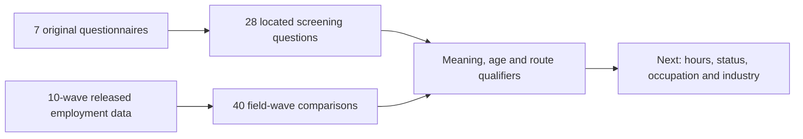

# CSES employment screening alignment brief

Local review of four screening families; no EC database or canonical-data changes.

EC contains **332,903 member-wave records and 60 fields**: 39 employment fields and 21 context/identity/provenance fields. This first batch checks four families, 28 question-wave correspondences in seven English forms, and 40 field-wave data profiles. The remaining 35 employment families are not certified by this work. The 2014 draft and 2007/2017/2019 household-form gaps remain visible.

## Confirmed meaning changes

| Field | 2004 | 2009–2016 inspected forms | 2021 |
| --- | --- | --- | --- |
| worked_at_least_one_hour_past_7_days | Any work, including farm/household business | Any work including farm/household business | Paid work; note also includes business owners or workers on holiday |
| second_work_screening_source_code | Job temporarily absent, if no work | Job/economic activity temporarily absent, if no work | Unpaid work, if no paid work |
| actively_seeking_work | Past seven days | Past four weeks | Past four weeks |
| available_for_work | During past seven days | Past seven days OR able to start within next two weeks | Past seven days OR able to start within next two weeks |

The second screen is intentionally retained as raw 1=Yes / 2=No; it must not be labeled uniformly as temporary absence. The other three fields use harmonized 1=Yes / 0=No. The printed binary option lists agree, but their meanings and routes do not. Do not calculate a comparable employment rate from the first question alone, or classify both-screen-No records as unemployed without a separate definition.

All 2021 continuation notes were included: the paid-work holiday note is in F7 and the unpaid farm/household-business examples in P7. Only reading the question headline would omit these qualifications.

## Four 2009 links recovered from a subsection-letter mismatch

The printed form has section 15, subsection A and questions 3/4/26/28, whereas released variables use q15_c03/c04/c26/c28. The earlier prefix matcher therefore supplied no candidate links. This review records explicit same-wave sheet/cell, printed number, wording and source-variable correspondence for those four fields. It does not rewrite the old heuristic workbench or publish new database links.

## Population and screening counts

| Wave | EC records | Printed minimum age | At/above minimum | Below minimum | Missing age | Unmatched HL |
| --- | ---: | --- | ---: | ---: | ---: | ---: |
| 2004 | 74,719 | 10 | 58,673 | 16,045 | 1 | 0 |
| 2007 | 15,766 | Not verified | Not verified | Not verified | 0 | 0 |
| 2009 | 51,460 | 5 | 51,460 | 0 | 0 | 0 |
| 2011-12 | 14,829 | 5 | 14,829 | 0 | 0 | 0 |
| 2013 | 15,774 | 5 | 15,774 | 0 | 0 | 0 |
| 2014 | 49,252 | 5 | 49,247 | 4 | 1 | 1 |
| 2016 | 15,498 | 5 | 15,494 | 3 | 1 | 1 |
| 2017 | 15,482 | Not verified | Not verified | Not verified | 0 | 0 |
| 2019 | 40,379 | Not verified | Not verified | Not verified | 0 | 0 |
| 2021 | 39,744 | 5 | 39,744 | 0 | 0 | 0 |

Questionnaire eligibility is age 10+ in 2004 and 5+ in the six inspected later waves. No age cutoff is borrowed for the three form gaps. The instructions request individual interviews, but these data counts do not establish actual interview-respondent counts. The two unmatched EC records are retained; ages may use released fallback data when no HL link exists.

| Wave | First screen Yes | Second screen Yes after first No | Both screens No |
| --- | ---: | ---: | ---: |
| 2004 | 42,661 | 387 | 15,500 |
| 2007 | 10,121 | 46 | 5,587 |
| 2009 | 34,926 | 276 | 16,258 |
| 2011-12 | 10,071 | 34 | 4,724 |
| 2013 | 9,901 | 49 | 5,824 |
| 2014 | 31,225 | 56 | 17,971 |
| 2016 | 10,127 | 24 | 5,347 |
| 2017 | 10,020 | 68 | 5,394 |
| 2019 | 24,310 | 2,443 | 13,626 |
| 2021 | 23,442 | 2,378 | 13,920 |

These are unweighted released response combinations across all table rows, not certified employment/unemployment counts. 2004 general sampling weights remain unavailable. Missing/invalid codes and structural skips are not converted to No.

## Routing and limits

- First-screen Yes skips the second question and proceeds to job details (question 5).
- The second-screen No branch goes to availability question 7 in 2004; in later forms it goes to job-search question 26.
- Later question 26 applies when both screens are No; a No search answer skips to question 31 and bypasses availability question 28. Therefore availability non-null counts cannot serve as the denominator for every non-worker.
- For the 2004 availability profile, the diagnostic route uses both screens No. The search question explicitly refers to no work and no job. Other downstream underemployment/job-detail routes are outside this four-question batch.
- Values recorded outside literal routes are retained and counted, not automatically deleted or recoded.

## Evidence and reproducibility

[Field-wave counts and source locators](cses-employment-screening-field-waves.md) include non-null counts, literal-route counts and recorded values outside routes. [Machine-readable evidence](../data/processing/cses/employment_screening_review_v1/review.json) retains original wording, split option cells, source hashes, raw code frequencies and qualifications.

Original seven workbooks were freshly re-extracted with macro-disabled legacy conversion and all sheets compared with frozen cells. All four source transformations were reproduced across ten waves, including the two-file 2004 person merge. A forced read-only database transaction compared every selected value across 332,903 rows: four screening fields, wave/person key, age and HL-link flag. This is not a fresh full-row validation of the remaining EC fields. No individual records are written to the reports.

This local review diagram does not replace the published database graph v12.

Reproduce the original-workbook check with the bundled Python runtime: `rsc/cses_db/review_cses_employment_screening.py --verify-workbooks --soffice /path/to/bundled/soffice`. Then run `.venv/bin/python rsc/cses_db/review_cses_employment_screening.py --check-database`. Changed snapshots require a fresh `--output` directory.

Next review the remaining 35 employment families, beginning with working hours and job status, then occupation/industry classifications, pay and job-search detail. No new pooled labour-force definition has been adopted. Spreadsheet guidance informed split-option/continuation-note inspection and preservation of original questionnaire files.
