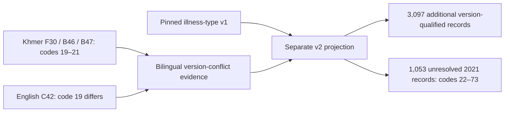

# 2021 illness-type dictionary recovery from the Khmer form

[Documentation index](README.md) · [HEALTH module](cses-health-module.md) · [Preserved v1 review](cses-health-illness-type.md)

## Result

Publication follow-up: these preserved v2 results are now included in the separate
[HEALTH database release](cses-health-database-release.md), with all language/version limitations intact.
The local review manifests below continue to describe the earlier, non-publishing review stage.

The **cached Khmer questionnaire supplies codes 19–21 that the English-only v1 review missed**.
This is direct question-specific source evidence, not a shifted 2019 dictionary or an inference from
frequencies. The earlier suggestion that the available questionnaires could not explain codes above
19 was incomplete: the English and Khmer versions differ.

| 2021 code | Exact Khmer label | Review English gloss | Source records | Eligible with version qualification |
| ---: | --- | --- | ---: | ---: |
| 19 | ជម្ងឺកូវីដ-១៩ | COVID-19 (reported) | 40 | 40 |
| 20 | គ្រុនផ្តាសាយ | Flu/cold (Khmer questionnaire category) | 2,442 | 2,442 |
| 21 | ជំងឺផ្សេងទៀត (បញ្ជាក់)... | Other diseases (specify) | 616 | 615 |

**3,098 source answers now have a recovered label**, of which **3,097** pass the existing screening,
linkage and branch checks. One code-21 answer belongs to an injury-only person and remains excluded.
English glosses are review translations, not official English labels or clinical diagnoses; the exact
Khmer wording is retained. In particular, code 20 is not automatically equated to the 2019 Fever/Cold
category, the earlier Flu category, or a laboratory-confirmed influenza diagnosis.

**52 observed codes (22–73), representing 1,053 records, remain unresolved.** They are not mapped
to other diseases merely because the Khmer form has an "other" response. The full post-coding
dictionary is still needed, so this is partial recovery rather than complete dictionary reconstruction.

## Exact questionnaire evidence

The copied originals in the [questionnaire library](../data/processed/cses_questionnaires/v1/README.md)
were inspected read-only using the spreadsheet workflow. No macros were run and neither workbook was
edited or exported. Their immutable all-sheet text extracts and package comments were inspected.

- Khmer source ID: `253ed542d52c8f46`.
- Original: `CSES2021 HH Quest KHM.xlsm`, SHA-256
  `162c3c5217dcd454fa509b695f7eca7ba476a42682ab002fadf9a59814bfcfda`.
- Sheet: `13 HEALTH CARE SEEKING_EXPE-2`.
- `F9`: illness-type question, conditional on illness, with a 30-day period.
- `F30`: printed column `(2b)`; `B46`: code list explicitly for column 2b.
- `B47`: numbered list 1–21, including the three recovered labels above.
- `B3`, `B5`, `B9`, `B27`, `B30` and `F24`: resident-member universe, period, screening, routing
  and code-entry context, retained in the evidence artifact.

The English source `715917b0b0b7597b`, sheet `13 Health Care Seeking _ 2`, cell `C42`, still lists
**19 = Other diseases** and stops there. The dedicated Stata source defines native value labels
only for **1–18**. The recovery therefore carries an explicit **language/version qualification**;
it does not claim that the entire English instrument is invalid or that all questions prefer Khmer.

Neither workbook has a hidden worksheet. Their comment parts contain no additional disease-code list.
This check does not certify arbitrary embedded images or macro binaries as an exhaustive dictionary
source; no readable evidence for codes 22–73 was recovered here.

## Data interface and preserved history

The new projection retains all **358,859 person-wave rows**. Native type codes, all answer slots,
identifiers, screening answers and original conservative eligibility flags remain unchanged.

For **2021 codes 19–21 only**, v2 changes `category`, `category_status`, the review English label
and the unresolved-code flag. The previous interpretations remain in `_v1` columns. The 2021
wave-level status becomes `partial_khmer21_unresolved_extensions`; other waves remain unchanged.

- `within_wave_analysis_eligible`: the original conservative selection, unchanged. For 2021 it
  still selects **2,509** records with supported codes 1–18.
- `version_qualified_analysis_eligible`: **3,097 additional** 2021 records supported by the Khmer
  form and passing the prior screening/linkage checks.
- `within_wave_eligible_with_qualifications`: the explicit union. For 2021 this selects **5,606**
  records; across the previously reviewed within-wave families it selects **11,074** records.
- `core18_comparison_candidate`: unchanged. Newly recovered COVID/flu/other categories are not
  silently treated as additional cross-wave equivalents.

These are unweighted person-wave record counts, not population estimates or unique longitudinal
respondents. Unknown categories can create selection bias: do not use a complete-case subset as a
full population disease-prevalence denominator or set unknown disease indicators to zero.

The type review queue decreases from **4,184 in v1 to 1,087 in v2**: 28 explicit 2004 missing codes,
one 2016 outside-branch answer, and 1,058 records in 2021 (1,053 unresolved codes, three outside-branch
answers, two missing type answers in the illness branch). V1 files and all prior release evidence are
unchanged; this step does not publish a PostgreSQL relation, graph version, Git commit or DVC version.

## Dictionary search ledger

The focused investigation on 2026-09-07 also checked the following alternatives:

| Source | Finding | Implication |
| --- | --- | --- |
| Dedicated 2021 `S13B_PersonIllness.dta` | Native dictionary stops at 18; no free-text type field | Native labels alone cannot resolve the extensions |
| 2021 `S01A_HHmemberAllvar.dta` | Same type question and 1–18 dictionary | Integrated source does not supply extra labels |
| 2021 `S01-17_HHOtherInfo.dta` | No matching illness-type field | Not a replacement dictionary |
| Central directories of the two local 2021 ZIP files | Stata files and the two household workbooks; no separate codebook/script member | Only targeted new source headers were read; routine builders remain archive-free |
| Dedicated DTA characteristics/notes | No usable extension-code dictionary recovered | No extra mapping asserted |
| Cached English and Khmer household forms, comments and hidden-sheet inventory | Khmer B47 supplies 19–21; English C42 conflicts at 19 | Apply only the three direct, version-qualified mappings |

The [NIS 2021 catalog file list](https://nada.nis.gov.kh/index.php/catalog/48/data-dictionary/F31?file_name=personillness)
contains a `personillness` file and a link to `q13bc2b`. The linked
[variable page](https://nada.nis.gov.kh/index.php/catalog/48/variable/F31/V475?name=q13bc2b)
could not be verified during this investigation. Direct HTTPS requests encountered HTTP 403 on the
`nada` host and a certificate hostname mismatch on the `microdata` host; certificate validation was
not disabled. The browser/search retrieval could read the file list but not the target variable page.
This is **access-limited evidence**, not proof that the official dictionary is absent.

The [public NIS study-metadata export](https://microdata.nis.gov.kh/index.php/metadata/export/48/json)
was readable through web retrieval, but the retrieved study-description text supplied no code-to-label
mapping for this item. No unpublished microdata were requested or uploaded. No agency was contacted.

## Artifacts and reproduction

- [Generated brief](../data/processing/cses/health_illness_type_khmer_v2/README.md)
- [Pinned bilingual questionnaire cells and package checks](../data/processing/cses/health_illness_type_khmer_v2/questionnaire_evidence.json)
- [Recovered codes, translations and counts](../data/processing/cses/health_illness_type_khmer_v2/recovered_codes.json)
- [Unresolved 22–73 codes and counts](../data/processing/cses/health_illness_type_khmer_v2/unresolved_codes.json)
- [Updated all-row projection](../data/processing/cses/health_illness_type_khmer_v2/illness_type.parquet)
- [Remaining type-review queue](../data/processing/cses/health_illness_type_khmer_v2/type_exceptions.parquet)
- [Input/output/implementation hashes](../data/processing/cses/health_illness_type_khmer_v2/manifest.json)
- [Specification](../rsc/specs/cses_health_illness_type_khmer_v2.json)

```bash
<bundled-python> rsc/cses_db/recover_cses_2021_illness_dictionary.py forms
.venv/bin/python rsc/cses_db/recover_cses_2021_illness_dictionary.py build
.venv/bin/pytest -q rsc/tests/test_cses_health_illness_type_khmer.py
```

Both stages use existing extracted files, pin the v1 review and refuse differing overwrites.



## Verification record

The complete suite passed **441 tests**, including nine new Khmer-recovery tests. Ruff and Git
whitespace checks passed. Both stages reproduced the same immutable outputs. Independent checks
verified the manifest hashes, reconstructed every v1 column exactly from v2 plus the retained `_v1`
columns, and reconciled all 358,859 source rows, recovered-code counts, explicit eligible subsets and
remaining 22–73 codes. The preserved v1 manifest and its source-data dependencies still match their pins.

## Remaining requirement

Completing the dictionary requires the NIS **2021 `q13bc2b` post-coding list for 22–73**, its version
identifier and any rule relating it to the Khmer form's other/specify field. Do not transfer a 2019
list or infer meanings from the category frequencies. A later recovery must be a new versioned review.
