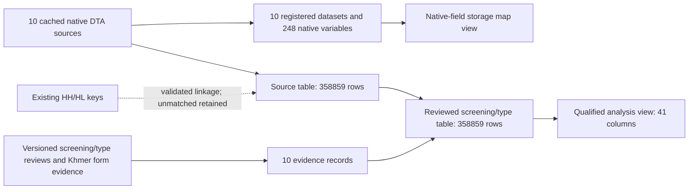

# HEALTH illness/care database release and variable brief

Release: `cses-health-illness-qualified-v1`. User authorization: “可以入库”, 2026-09-07.

Status: committed and independently validated. **450 tests pass**; all five aggregate SQL examples
run successfully as `mda_readonly`. Graph v15 contains **5,118 nodes and 8,000 edges**, preserving
all 4,853 nodes and 7,677 edges of v14. The live catalog now has 40 CSES physical tables, 181 datasets
and 4,340 native variable records; the 280 canonical-variable definitions are unchanged.

Publication scope is ten illness/care sources and two reviewed concepts, not all 68 HEALTH sources.
The earlier source preflight and local review manifests remain immutable historical evidence;
their `publication_approved: false` describes those earlier stages, not this new authorized release.

## Database entry points

| Relation | Rows | Columns | Purpose |
| --- | ---: | ---: | --- |
| `cses_data.cses_health_illness_source_v1` | 358,859 | 14 | All native answers in `raw_record`, original source identity and linkage flags |
| `cses_data.cses_health_illness_review_v1` | 358,859 | 41 | Exact reviewed screening/type v2 projection, including conservative v1 flags |
| `cses_alignment.cses_health_illness_evidence_v1` | 10 | 6 | Local source ID → registered dataset ID, original DTA hash, field maps and versioned questionnaire evidence |
| `cses_analysis.cses_health_illness_v1` | 358,859 | 41 | Preferred qualified analysis entry point; no implicit filtering |
| `cses_analysis.cses_health_illness_native_fields_v1` | 248 | 14 | Native variable → source dataset → JSON storage path, without semantic equivalence claims |

No new schema or `public` aliases are needed. Three new physical tables and two views are additive;
the seven core data tables and all prior interfaces remain untouched. `mda_readonly` has SELECT
access to all five objects. No new canonical-variable or question-equivalence claim is inserted.
The existing 280-field canonical inventory remains a seven-core-table inventory, not a count of
every column exposed by new HEALTH interfaces. Forty-one review columns include keys, provenance,
raw values, eligibility and historical flags; they are not 41 health concepts.

## Respondents and coverage

There are **358,859 person-wave source records** in **77,898 household-wave keys**. These are not
358,859 independently interviewed people or a longitudinal panel. The household questionnaire can
use proxy reporting. All records match HH; **358,854 match HL**, while five source people absent
from HL remain explicitly flagged. Conversely, **66 HL records have no illness/care source row**;
they are not imputed as healthy or zero expenditure. All IDs remain wave-local.

| Wave | Source records | Strict screening eligible | Type eligible, conservative | Type eligible, with qualifications |
| --- | ---: | ---: | ---: | ---: |
| 2004 | 74,719 | 0 | 0 | 0 |
| 2007 | 17,401 | 0 | 0 | 0 |
| 2009 | 57,082 | 57,082 | 0 | 0 |
| 2011-12 | 16,327 | 0 | 0 | 0 |
| 2013 | 17,225 | 17,225 | 2,974 | 2,974 |
| 2014 | 53,968 | 0 | 0 | 0 |
| 2016 | 16,985 | 16,981 | 2,494 | 2,494 |
| 2017 | 16,909 | 0 | 0 | 0 |
| 2019 | 44,548 | 0 | 0 | 0 |
| 2021 | 43,695 | 43,689 | 2,509 | 5,606 |
| Total | 358,859 | 134,977 | 7,977 | 11,074 |

Zero eligible records does not mean zero disease or missing source data. It reflects the scope
of the conservative evidence/eligibility contract. Values retained outside it need wave-specific review.

## What can be analyzed?

- **Recent illness/injury, 30 days**: use `strict_screening_eligible`, then
  `recent_illness_injury_30d` (1 Yes, 0 No, NULL unknown). The four supported waves are 2009, 2013,
  2016 and 2021: 134,977 eligible records, including 20,620 reported Yes. Weighted inference still
  requires the appropriate wave sampling design and carefully joined weights.
- **Illness type**: use `within_wave_eligible_with_qualifications` within `survey_wave` and
  `type_family`, keeping `category_status`. The 11,074 eligible type records are not a population
  prevalence denominator and do not form a common ten-wave classification. The original conservative
  `within_wave_analysis_eligible` remains unchanged (7,977). Eighteen corresponding detailed labels
  are response categories of one concept, not eighteen separate aligned variables.
- **2021 Khmer qualification**: codes 19/20/21 mean reported COVID-19, Khmer flu/cold category and
  other specified disease in that form. Their 3,098 recorded answers add 3,097 eligible records;
  one branch-conflicting record remains excluded. Exact Khmer labels and bilingual form locators
  are stored in the evidence table. English glosses are review translations, not clinical diagnoses.
  Codes **22–73 remain unresolved for 1,053 records**, with NULL `category` and false eligibility.

Neither concept is fully aligned across all ten waves. The 2004 broader 28-day family stays separate;
2007's five answer slots remain intact; no 2016-to-2017 semantic transfer is made. The 2011-12
distributed form and 2014 draft remain qualified, and 2019's reference period is not certified.
Do not reinterpret unknowns as No/Other or combine incompatible illness-type families.

Other care, expenditure and disability fields in the ten files are stored in native JSON and
documented by their original labels; they have not been newly harmonized. Other HEALTH topic
sources remain in the local intake and are not published by this release.

## Provenance and topology

Arrows from local evidence to reviewed results represent processing provenance, not SQL dependencies.
The analysis view depends on the reviewed table; the native-field view depends on the evidence and
source-variable registries. All three new physical objects receive ten dataset-output registrations
(30 total). `output_row_count` follows the existing registry convention: total target-table rows,
not source contribution counts. Individual source contributions remain in dataset row counts.

The source layer retains original field case, all numeric sentinels, JSON nulls and all rows.
JSON numbers are compared semantically and exactly after PostgreSQL JSONB normalization; JSON key
ordering/formatting is not byte-preserved. Original DTA bytes remain fingerprinted in the local cache.

No unreviewed `question_id` or semantic value mapping is fabricated. Source variables are registered
as `documented`; review decisions and questionnaire locators are stored in the versioned evidence
JSON and referenced from the release. This keeps storage provenance separate from full alignment.

## Execution and verification

The publisher pins all source/review artifacts and implementation fingerprints. It backs up the six
metadata tables that receive append-only records to the external `PG_DB` directory, verifies full
archive decompression, fingerprints the 37 pre-existing CSES physical relations, and checks every
live HH/HL key against its local baseline before writing. Survey microdata are not modified.

The required rehearsal creates and loads all new objects inside one transaction, checks every
source/review cell, questionnaire evidence and read-only access, then rolls back. PostgreSQL identity
sequences can have harmless gaps after rehearsal; no old rows or object definitions are changed.
The same checks run before commit and in an independent read-only validation after commit.

Historical graph v14 is retained; v15 extends it with this release's metadata and HEALTH relations.
The legacy “all storage tables have public compatibility views” graph check no longer applies to
new HEALTH tables: they deliberately use `cses_analysis`, not additional `public` aliases.

- [Execution manifest](../data/releases/cses-health-illness-qualified-v1/execution.json)
- [Rollback rehearsal](../data/releases/cses-health-illness-qualified-v1/rollback_test.json)
- [Committed import evidence](../data/releases/cses-health-illness-qualified-v1/import.json)
- [Independent validation](../data/releases/cses-health-illness-qualified-v1/validation.json)
- [Natural-key, SQL-dependency and analysis-count validation](../data/releases/cses-health-illness-qualified-v1/supplementary_validation.json)
- [Graph v15](../data/lineage/cses_lineage_graph_v15.json)
- [Aggregate SQL examples](../rsc/sql/cses_health_illness_examples.sql)
- [Publisher](../rsc/cses_db/publish_cses_health_illness.py)

This database publication does not perform Git commit/push or DVC add/push. Those remain separate
versioning operations. The execution manifest pins dirty-worktree code, so a Git base revision alone
must not be represented as the exact published implementation.

The first unpublished execution draft failed during SQL template construction and its transaction
rolled back. Its draft manifest and backup remain available for audit. The corrected publisher added
a regression test, then passed a complete rehearsal before the final execution fingerprint
`836ae1258cf9655f8021e3319a331d2fedba072052ef24cafdcf84da20e850ee` was committed.
