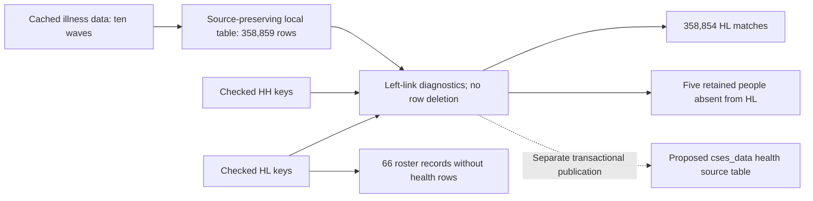

# First HEALTH table: illness and care

[HEALTH module](cses-health-module.md) · [Documentation index](README.md)

## Decision and delivery

Subsequent publication: the [authorized HEALTH database release](cses-health-database-release.md)
implements this design with backup, transactional rehearsal, registry entries and independent validation.
This document and its immutable plan retain the historical read-only preflight scope below.

**Design and read-only structural preflight completed. The database table has not been created.**
The proposed target is `cses_data.cses_health_illness_source_v1`, with **358,859 source records across
ten waves**. This is a source-preserving table, not a fully harmonized health analysis table.

- [Local table, per-wave coverage and exception files](../data/processing/cses/health_illness_preflight_v1/README.md)
- [Machine-readable design and preflight](../data/processing/cses/health_illness_preflight_v1/plan.json)
- [Field specification](../rsc/specs/cses_health_illness_table_v1.json)
- [Proposed DDL, not executed](../data/processing/cses/health_illness_preflight_v1/proposed_schema.sql)
- [Native source-variable catalog](../data/processing/cses/health_illness_preflight_v1/source_variables.json)

No PostgreSQL write, replacement, archive extraction, Git commit or DVC push was performed. The
planner reads the extracted HEALTH/questionnaire caches, local HH/HL baselines and, in database-check
mode, only the relevant live database key projections and catalog metadata.

## Table design

The table has **14 storage columns**, not 14 health questions. The ten native source files contain
**248 native field occurrences**, including IDs, context, repeated fields and health questions.
Their original names, case, values, variable positions and labels remain available. The dictionaries
do not assert that a repeated name has identical meaning in every year.

| Purpose | Proposed columns | Rule |
| --- | --- | --- |
| Linkage identity | `survey_wave`, `household_id`, `person_id` | Reuse existing HH/HL minimum-width normalization; never truncate longer identifiers |
| Source identity | `source_id`, `source_row_number`, `source_archive`, `source_member_chain`, `source_sha256` | Preserve original member provenance and one-based source-row location |
| Native answers and context | `raw_record` | JSONB object containing every original field; original names and numeric sentinel codes remain unchanged |
| Linkage diagnostics | `hh_link_matched`, `hl_link_status`, `roster_household_id` | Distinguish matched, person absent from roster and household conflict; retain all rows |
| Evidence and interpretation | `questionnaire_evidence_status`, `harmonization_status` | Form availability is not semantic approval; interpretation remains `native_codes_not_harmonized` |

JSONB avoids prematurely merging different source questions into a common analytical column. The local
Parquet serializes these JSONB columns as JSON text for a future loader. A later reviewed analysis view
can expose named, typed variables with explicit valid years, code mappings, denominators and units.

The proposed primary key is `(source_id, source_row_number)`, with an additional unique key on
`(survey_wave, household_id, person_id)`. Both were checked locally. No new foreign key to HL is
proposed because unmatched people must remain visible. The source ID is a local source fingerprint
identifier, not an existing integer `cses_meta.cses_dataset.dataset_id`.

All native fields were serialized and reconstructed exactly, including float values, original letter
case, strings, nulls and numeric codes such as `9/98/99`. No dates, response codes or monetary units
were reinterpreted. The source intake has no extended Stata `.a`–`.z` missing codes; this version fails
explicitly if such values appear, instead of collapsing their meaning into an ordinary JSON null.

## Linkage results

The live database's **358,920 HL key rows** and **77,904 HH key rows** exactly match their local
baseline projections. This comparison covers the displayed key columns, not all other database values.

| Wave | Health source records | Matched to HL | Health records without HL person | HL records without matching health record |
| --- | ---: | ---: | ---: | ---: |
| 2004 | 74,719 | 74,719 | 0 | 0 |
| 2007 | 17,401 | 17,401 | 0 | 38 |
| 2009 | 57,082 | 57,082 | 0 | 23 |
| 2011-12 | 16,327 | 16,327 | 0 | 0 |
| 2013 | 17,225 | 17,225 | 0 | 0 |
| 2014 | 53,968 | 53,966 | 2 | 2 |
| 2016 | 16,985 | 16,982 | 3 | 3 |
| 2017 | 16,909 | 16,909 | 0 | 0 |
| 2019 | 44,548 | 44,548 | 0 | 0 |
| 2021 | 43,695 | 43,695 | 0 | 0 |
| Total | 358,859 | 358,854 | 5 | 66 |

All 358,859 health records match an HH household-wave. They represent 77,898 distinct household-wave
keys; this does not imply every HH member has a health record or answered every health question.
There are no observed cases of a health person ID matching HL with a different household ID.

The five unmatched health records have non-null native health responses. Their reported member-line
numbers reproduce the existing source person IDs, and those IDs still do not occur in HL. This
check does not establish why the roster differs or authorize a correction. All five rows are retained
with `hl_link_status='person_not_in_roster'`; no person characteristics or weights are fabricated.

The reverse difference is **66**, not 61: five health-only records and 66 roster-only records yield
the overall 61-row difference between HL and the health sources. The 66 roster-only records do not
mean “healthy,” “no treatment” or “zero medical spending.” No health answers are synthesized for them.
Exact identifiers are retained only in the DVC-owned exception Parquets linked from the local index.

Record counts are not counts of personally interviewed respondents, eligible populations, valid
answers, sick people or healthcare users. Those denominators require question-specific review.

## Questionnaire boundaries

The status column distinguishes ordinary local form availability, the provisional 2014 draft,
the image-based 2019 bundle and the missing household forms for 2007/2017. It never asserts that
the entire health section is verified. Existing limited housing decisions do not authorize a new
health-question transfer from 2016 to 2017. No new question text or question link was registered.

## Structural preflight and publication boundary

The read-only database checks passed:

- Proposed target is absent in `cses_data`.
- The connected database role has CREATE privilege in the existing `cses_data` schema.
- No active DDL event triggers were found.
- All relevant HH/HL key rows match the local baseline and have non-ambiguous linkage keys.
- The ten illness/care source datasets have no matching existing dataset registration.

The current database still has **37 CSES physical relations**, **171 registered datasets**,
**4,092 source-variable records** and **280 canonical-variable records**. This preflight did not
alter any of those counts or change the published graph v14.

Before an actual release, implement and validate the scoped metadata registration, source-to-output
mappings, storage registry, named release, load-run evidence, database backup, transactional loader,
reader permissions, full post-load comparison and lineage export. The proposed DDL is deliberately
not executed by the planner. Structural preflight is not a test of an actual COPY/INSERT transaction
or a certification that all health variables are comparable across years.

## Processing topology



This is a local plan diagram. It adds no nodes or edges to the current published PostgreSQL graph.

## Reproduction

```bash
.venv/bin/python rsc/cses_db/plan_cses_health_illness.py --check-database
```

This mode uses a repeatable-read, read-only transaction. Without `--check-database`, only local
checks run; choose a separate output directory to preserve the database-checked plan. Existing
different outputs are never overwritten. Source archives need not be opened for either mode.

Local and database-key inputs, implementation hash, source member identities and output hashes are
recorded in `plan.json`. There is intentionally no `apply` or database-write mode.

## Verification record

On 2026-09-06, all **397 tests** passed, including 19 new tests for HEALTH table design, identifier
validation, linkage states, native-value precision and evidence boundaries. Ruff and Git whitespace
checks passed. Repeating the complete database-checked plan reproduced every artifact and the plan
without a differing overwrite. All input/output hashes were verified and all 12 local documentation
links resolved. Source/roster coverage totals reconcile in both directions. The database transactions
were read-only, and no target table or new published lineage graph was created.
