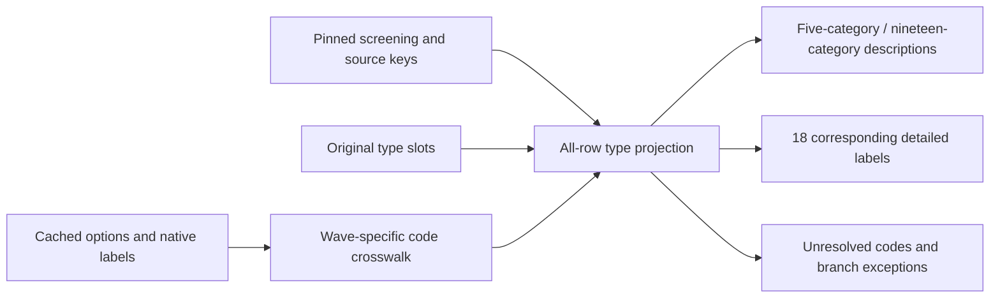

# HEALTH variable brief: illness type

[Documentation index](README.md) · [HEALTH module](cses-health-module.md) · [Screening variable](cses-health-recent-illness.md)

## Result

Publication follow-up: the [HEALTH database release](cses-health-database-release.md) publishes the
v2 qualified projection and retains the v1 values/eligibility flags. This document's original counts
describe the conservative v1 review and must not replace the current v2 release denominators.

**Follow-up:** the [Khmer-form v2 recovery](cses-health-2021-dictionary-recovery.md) now resolves
2021 codes 19–21 with explicit language/version qualifications. Codes 22–73 (1,053 records) remain
unresolved. The numbers and English-only findings below describe the preserved **v1** review.

The second HEALTH concept has been reviewed across all ten source waves. This delivery provides a
**partial, local illness-type crosswalk**, not a fully equivalent ten-wave variable and not a database
publication. The earlier screening projection, 14-column source-table preflight, original questionnaires
and native health data are unchanged. No archive extraction, PostgreSQL connection, Git commit or DVC
push is part of this step.

For 2011 onward where the form is available, the question asks the **main presenting illness in the
last 30 days**, only if an illness; injury-only cases skip illness type. This is household-proxy reporting,
not a medical diagnosis, a complete disease history or the prevalence of every condition a person has.

The main findings are:

- **2011-12/2013/2014 use five categories:** fever, cough, diarrhoea, flu, other. The first and last
  waves retain their distributed-form/draft-form qualifications; 2013 has the strongest form support.
- **2016 uses 19 categories.** Its first 18 labels match both the 2019 native dictionary and the
  2021 form/native labels. The 19th category does not have stable cross-wave meaning.
- **2021 is only partially resolved.** Its form lists 19 options, but its data contain 73 different
  numeric codes and the native dictionary defines only 1–18. Codes 20–73 remain unexplained; code 19
  has only the printed "Other diseases" evidence and is held out of the conservative result.
- **2004, 2007 and 2009 have different structures**, documented below. 2017 is still unverified.

These are **18 corresponding category labels within one variable**, not 18 newly aligned variables.
HEALTH now has two reviewed concepts (screening and illness type), but neither is fully aligned across
all ten waves or published as a new HEALTH database variable.

## Coverage and denominators

All **358,859 person-wave source rows** are retained, including people without an illness-type answer.
Counts below are unweighted records, not unique longitudinal people or personally interviewed respondents.

| Wave | Source rows | Rows with a recorded type value | Printed options / native evidence | Conservative within-wave usable type records |
| --- | ---: | ---: | --- | ---: |
| 2004 | 74,719 | 14,009 | 41 options; native code 99 means missing | 0 — separate 28-day concept |
| 2007 | 17,401 | 2,608 | Five unlabelled answer slots; form absent | 0 — unverified |
| 2009 | 57,082 | 0 | No type item in this reviewed illness/care section | 0 — not collected here |
| 2011-12 | 16,327 | 2,581 | 5 options; distributed 2011 form | 0 — qualified |
| 2013 | 17,225 | 2,974 | 5 options | 2,974 |
| 2014 | 53,968 | 7,794 | 5 options; draft form | 0 — qualified |
| 2016 | 16,985 | 2,495 | 19 options; 17 distinct observed codes | 2,494 |
| 2017 | 16,909 | 2,415 | 18 distinct observed codes; no labels/form | 0 — unverified |
| 2019 | 44,548 | 7,354 | 72 native labels; 70 observed codes; image form untranscribed | 0 — native-label qualification |
| 2021 | 43,695 | 6,662 | 19 printed options; 18 native labels; 73 observed codes | 2,509 — codes 1–18 only |

"Recorded" includes explicit missing codes and branch-conflicting answers. Zero in the last column
means exclusion from the conservative default, not absence of usable native information or no disease.
The **7,977 within-wave usable records** must retain their wave and classification family. They must
not be pooled as if five symptom choices and a detailed disease list were the same response menu.

For the detailed 1–18 labels, the conservative candidate subset is **3,696 records**:
**1,187 in 2016** and **2,509 in 2021**. This deliberately excludes other/unresolved categories.
It is **not a suitable full denominator for disease prevalence**, because exclusion is related to the
reported category. Missing/unresolved categories must not become negative disease indicators.

## Category correspondence

| Stable detailed code | Literal label in 2016 form and 2019/2021 native labels |
| ---: | --- |
| 1 | Respiratory |
| 2 | High blood pressure |
| 3 | Diabetic |
| 4 | Heart diseases |
| 5 | TB |
| 6 | HIV/AIDS |
| 7 | Miningitis |
| 8 | Malaria |
| 9 | Diarrhea |
| 10 | Dengue-Fever |
| 11 | Cholera |
| 12 | Typhoid |
| 13 | Liver cancer |
| 14 | Lung cancer |
| 15 | Cervical cancer |
| 16 | H1N1 |
| 17 | H5N1 |
| 18 | Chikungunya |

Literal source spellings are preserved alongside machine-readable semantic names. Corresponding labels
are evidence of category naming, not proof that the overall coding procedure or response distribution
is unchanged. The expanded 2019 dictionary includes overlapping descriptions, such as additional
heart-disease or diabetes-related labels; this review does not clinically regroup them into the original
18 categories. Category-choice and post-coding changes remain a limit on trend analysis.

Diarrhoea has label-level correspondence between code **3 in the five-category family** and **9 in the
detailed family**. Other codes cannot be matched by number: five-category code 3 is not diabetes, and
five-category code 5 is not TB. Fever, cough and flu are not silently merged into "Respiratory".
The residual "other" in a five-option list is kept distinct from "other" in a 19-option list.

## Important exceptions

### 2021: incomplete coding dictionary

- **4,111 recorded answers use codes 20–73**, with no available native labels and no matching printed
  options in the extracted English form. Of these, 4,110 are in the illness branch and one is an
  outside-branch answer. They are unresolved, not automatically invalid or "other".
- **40 answers use code 19.** The form says "Other diseases", but the native dictionary stops at 18
  while many extra codes appear. Keep the printed label as provisional evidence and the harmonized
  category null until the actual post-coding dictionary is recovered.
- **3 type answers are outside their branch:** two for people reporting no illness/injury and one
  for an injury-only person. All are preserved and excluded from the conservative subset.
- **2 illness-branch members have blank type answers.** These are distinguished from injury/no-problem
  skips; no disease category is imputed.

The 2019 native dictionary makes code **19 = Fever/Cold**, **20 = Brain tumor** and **72 = Others**.
It must not be copied into 2021 or shifted by one based on frequencies. No such transfer is applied.

### Earlier waves

- **2004:** one most-important illness, injury or other health-related symptom over **four weeks**.
  The 41 options include injuries and antenatal/postnatal/other care needs. Keep this separate from
  the later illness-only main-presenting question. There are **28 explicit code-99 missing answers**,
  leaving 13,981 recorded nonmissing categories; the prior screen's 98 missing codes are different.
- **2007:** five native slots contain **3,637 non-null values for 2,608 people**, of whom **867** have
  more than one slot filled. Slot order, permitted multiplicity and code meanings are unverified.
  All five slots are retained; no first-answer selection, deduplication or 2004 dictionary transfer.
- **2009:** neither the reviewed section's printed layout nor its dedicated source has the later
  illness-type item. This is a section-specific absence, not a claim that the entire survey contains
  no disease-related information.
- **2016:** one type answer occurs after a negative screen and is excluded. Nine positive-screen
  members have a blank type field. Because this screen combines illness and injury, a blank can be
  an injury skip or nonresponse; it cannot be classified as a missing illness answer from this alone.
  The corresponding conditional blanks are 3 in 2011-12, 3 in 2013 and 28 in 2014.

The new type exception file has **4,184 unique records**: 28 explicit 2004 missing codes, one 2016
outside-branch answer and 4,155 unique 2021 records across the overlapping flags above. It is a review
queue, not a list of 4,184 proven data errors. Unverified waves and conditional blanks remain separately
flagged in the complete projection. Earlier screening/roster exceptions are preserved as upstream fields.

## Outputs, provenance and usage

- [Generated per-wave brief](../data/processing/cses/health_illness_type_v1/README.md)
- [Native/printed code crosswalk and counts](../data/processing/cses/health_illness_type_v1/code_crosswalk.json)
- [Questionnaire cell evidence, source dictionaries and profiles](../data/processing/cses/health_illness_type_v1/wave_review.json)
- [Source-row type projection](../data/processing/cses/health_illness_type_v1/illness_type.parquet)
- [Retained type exceptions](../data/processing/cses/health_illness_type_v1/type_exceptions.parquet)
- [Fingerprint manifest](../data/processing/cses/health_illness_type_v1/manifest.json)
- [Crosswalk specification](../rsc/specs/cses_health_illness_type_v1.json)
- [Reproduction script](../rsc/cses_db/review_cses_health_illness_type.py)

The spreadsheet research workflow keeps the source questionnaires read-only and original values separate
from interpretation. `raw_type_answers` contains every native answer slot as JSON; `raw_type_code` is
populated only for a single-field source, so 2007 is not misleadingly flattened. All source IDs, row
locators and screening/key-quality fields survive. `source_interpreted_label` may be qualified/form-only;
always read it with `category_status`, `type_alignment_status` and `type_population_status`.

Use `within_wave_analysis_eligible` for the conservative, family-specific local descriptions. Use
`core18_comparison_candidate` only for exploratory label-level correspondence, keeping the unresolved
denominator and changed menu explicit. Neither flag replaces a weight/design review or a complete
analysis-specific comparability assessment.

```bash
.venv/bin/python rsc/cses_db/review_cses_health_illness_type.py
.venv/bin/pytest -q rsc/tests/test_cses_health_illness_type.py
```

The builder verifies the extracted health/questionnaire libraries, pins the previous screening manifest
and its dependencies, checks every source key/row locator and refuses differing overwrites. Original
archives need not be reopened. Any later recovered coding dictionary requires a new versioned review.



This is local processing topology, not a new published database graph. Graph v14 is unchanged.

## Verification record

On 2026-09-07, the complete suite passed **432 tests**, including 19 new illness-type tests. Ruff
and Git whitespace checks passed. Independent checks compared all original type slots, including
**49,921 non-null slot values**, and every inherited screening column across 358,859 rows. All
artifact/input/implementation hashes and 11 brief links matched. The 4,184-record review queue,
7,977 within-wave subset and 3,696 core-label candidates reconciled exactly. A second build reproduced
the same artifacts and manifest; protected EC publication fingerprints remained unchanged.

A targeted search for `q13bc2b`, `Fever/Cold` and `Brain tumor` in Python, Stata, R, SQL and JSON
files under the repository's `rsc` and the previously referenced `Research/MJ02` and `Research/MJ02b`
did not recover an additional illness-type dictionary. This does not rule out a dictionary in other
documents or unextracted material.

## Next priority

Recover the **2021 illness-type post-coding dictionary for codes 19–73**, and review the 2019 image-form
evidence before declaring a full detailed-category crosswalk. The next independent health variable is
**whether the same illness has lasted more than one year**; it can be reviewed without guessing the
unresolved disease categories. Database publication remains a separate controlled workflow.
