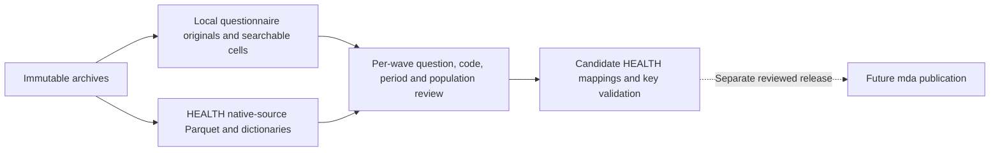

# HEALTH module and extracted questionnaire library

[Documentation index](README.md) · [Processing workflow](cses-processing-workflow.md)

## Current delivery

The [HEALTH database release and variable brief](cses-health-database-release.md) publishes the ten
illness/care sources and the two qualified review projections. The preferred entry point is
`cses_analysis.cses_health_illness_v1` (358,859 rows, 41 columns). Three new physical tables, two views,
ten source registrations and 248 native field registrations are added; the other 58 intake sources
remain local. Neither reviewed concept is equivalent across all ten waves.

The [2021 Khmer-form dictionary recovery](cses-health-2021-dictionary-recovery.md) resolves codes
19–21 for 3,098 recorded answers, including 3,097 additional version-qualified eligible records.
Codes 22–73 (1,053 records) remain unresolved. V1 and its original conservative flags remain intact.

The [second variable-level review: illness type](cses-health-illness-type.md) is now available. It
preserves all ten waves and 2007's five slots, separates five-category and detailed question families,
and identifies 18 corresponding detailed labels. The 2021 extended coding dictionary remains incomplete.
Two HEALTH concepts have been reviewed and their qualified results published; neither is fully aligned across all ten waves.

The [first variable-level review: recent illness or injury](cses-health-recent-illness.md) now provides
a separate local screening projection for all ten waves, with four form-supported 30-day mappings
and 134,977 records in its conservative subset. Other waves are explicitly qualified, separate or
unverified. This was the first reviewed concept; its historical local artifact is now consumed by
the named database release without an all-ten-wave equivalence claim. Original native codes remain unchanged.

The next [illness/care table design and read-only preflight](cses-health-illness-preflight.md) is now
available: 358,859 source records, 358,854 HL matches and five retained unmatched people. It does
not create a database table or alter the preserved source-intake counts below.

The repository has a **HEALTH source-intake module**, alongside the existing seven published
core modules. The illness/care release adds qualified HEALTH relations, not a single eighth fully
harmonized core table. Source intake, semantic review, database publication and Git/DVC versioning
are distinct stages; historical intake counts below remain unchanged.

Start with these local entry points, without opening source archives:

- [Questionnaire library: all ten wave directories](../data/processed/cses_questionnaires/v1/README.md)
- [Health source and variable index](../data/processed/cses_health/v1/README.md)
- [Questionnaire manifest](../data/processed/cses_questionnaires/v1/manifest.json)
- [Health source manifest](../data/processed/cses_health/v1/manifest.json)

The questionnaire library materializes **76 original files** from the existing fingerprinted
inventory: **27 form files** (including household/village questionnaires, diaries and listing)
and **49 reference files**. Alternate versions count separately. **26 form workbooks** also have
complete historical literal-cell extracts in JSON and readable Markdown, with worksheet names and
original cell coordinates. These extracts are reused only after matching their historical fingerprint
and the original member's SHA-256. Original spreadsheets are not edited, converted or executed by
the new cache builder. PDF and Word originals are copied byte-for-byte, not OCR-transcribed.

The health intake contains **68 source files**, including two empty village sources, and **1,192
retained native field occurrences**. The latter includes identifiers, demographics, weights and
repeated fields; it is not a count of distinct health questions or harmonized concepts. The native
row locator added to each Parquet is excluded from that count. The subsequent illness/care release
publishes two qualified concepts and five relations, not 1,192 harmonized variables or all 68 sources.

## Health coverage

The illness/care sources exist in all ten waves. The following counts are file rows, not the number
of people who were ill, sought treatment, answered a particular question or were personally interviewed.

| Wave | Intake source files | Illness/care source records | Questionnaire qualification |
| --- | ---: | ---: | --- |
| 2004 | 11 | 74,719 | Multiple original versions; registered version retained |
| 2007 | 9 | 17,401 | Village questionnaire only; household form not located |
| 2009 | 10 | 57,082 | Household questionnaire and alternate versions available |
| 2011-12 | 8 | 16,327 | Distributed 2011 form, not separately verified for 2012 |
| 2013 | 5 | 17,225 | Household form extracted from nested ZIP |
| 2014 | 6 | 53,968 | Household draft with WFP comments |
| 2016 | 5 | 16,985 | English household form available |
| 2017 | 4 | 16,909 | No located questionnaire; no new transfer from 2016 |
| 2019 | 4 | 44,548 | Image-based Word bundle extracted; transcription pending |
| 2021 | 6 | 43,695 | English and Khmer forms kept separately |

Topic groups cover illness and care, healthcare access/subsidies, maternal health, child feeding and
vaccination, child measurements, disability, tobacco, HIV/AIDS, fertility, mortality, accidents and
village health context. Topic assignment is source discovery, not an approved semantic crosswalk.
Early disability questions may be inside the illness source rather than an independent disability file.

The two 2014 village files `health.dta` and `medical.dta` have **zero rows**. Their file presence must
not be treated as usable respondent coverage. The 2014 medicine-price file has records and remains
separate. Village medical/price records are not individual health observations.

Health financing questions can also reside in mixed household files. The intake selects native
`q13a` columns plus available identifiers and weights from eight such sources. It also retains the
full original DTA, and catalogs all source columns with an explicit `included_in_parquet` flag.
Other questions in these mixed files are not included as HEALTH fields merely because they share a file.

In 2021, the dedicated `S13A_PersonHealthcare.dta` has **43,696 records**, while the mixed household
source has **10,080**. Both contain healthcare-access items but their grain and repeated household
values require review. They are not concatenated, deduplicated or counted as independent respondents.

## Preservation and local access

Each health source has an original DTA copy, native-code Parquet, variable metadata and an
extended-missing sidecar. Metadata retains original labels, storage types, value-label assignments,
non-null record counts, distinct observed values and candidate-key diagnostics. These are descriptive
checks, not confirmation of valid responses, survey universes or join contracts.

- All rows and native columns of dedicated sources remain; no filtering or cross-wave stacking.
- A one-based `_cses_source_row_number` identifies rows within each source. Source identity and wave
  reside in the manifest. This is not a longitudinal respondent ID.
- Ordinary Stata system missing becomes Parquet null. Extended `.a`–`.z` codes retain variable and
  source-row positions in `extended_missing.json`; none were observed in this intake. The full DTA
  remains the lossless original. Numeric sentinel codes such as `9`, `98` and `99` remain numeric.
- Stata dates remain native numeric values; no implicit date interpretation is performed.
- Original labels and observed distinct values are separate. Neither is a certified response-option count.
- Byte-identical aliases are recorded, but semantic duplicates across differently structured files are
  not automatically resolved.
- Existing seven-module builders, catalog snapshots and accepted publication evidence remain unchanged.

New questionnaire reviews should read `data/processed/cses_questionnaires/v1/` first. They should not
rerun archive extraction for routine lookup. Read the local manifest, choose the appropriate original
version/language, and use its searchable cells or open the copied document. The original archive/member
identity remains the provenance key even when the file is opened from this library.

Archive-free access in Python:

```python
import json
import sys
from pathlib import Path

sys.path.insert(0, "rsc/cses_db")
from build_cses_health import load_source
from cache_cses_questionnaires import cached_source

health = Path("data/processed/cses_health/v1")
catalog = json.loads((health / "manifest.json").read_text())
source = next(s for s in catalog["sources"]
              if s["survey_wave"] == "2021" and s["topic"] == "illness_care")
frame = load_source(health, source["source_id"])

library = Path("data/processed/cses_questionnaires/v1")
forms = json.loads((library / "manifest.json").read_text())
form = next(s for s in forms["sources"] if s["survey_wave"] == "2021"
            and s["instrument_type"] == "household_questionnaire"
            and s["language_code"] == "en")
original_path, evidence = cached_source(library, form["source_file"])
cells = json.loads((library / evidence["cells_path"]).read_text())["sheets"]
```

Both accessors verify the selected original or Parquet hash. Run whole-library verification to
also validate all text extracts, sidecars and indexes. A corrupt cache fails explicitly rather than
silently falling back to a ZIP. Archive-free validation checks the recorded local artifact hashes;
it does not claim that currently unmounted source archives were rechecked.

## Reproduction

For first construction or explicit disaster recovery only, use the bundled artifact Python runtime
for questionnaire materialization and the project runtime for Stata/Parquet processing:

```bash
<bundled-python> rsc/cses_db/cache_cses_questionnaires.py build
.venv/bin/python rsc/cses_db/build_cses_health.py build
```

Routine local integrity checks do not open source archives or PostgreSQL:

```bash
<bundled-python> rsc/cses_db/cache_cses_questionnaires.py verify
.venv/bin/python rsc/cses_db/build_cses_health.py verify
```

Builders refuse to overwrite differing output. Use a new version directory after source or
implementation changes. `manifest.json` records artifact hashes, original archive hashes, implementation
identity and upstream provenance. Generated artifacts under `data/processed/` are DVC-owned; this step
does not update DVC pointers or upload data.

## Topology and next review



This is a local processing topology, not a new published lineage graph. PostgreSQL graph v14 remains
unchanged. Prioritize the ten-wave illness/care module: establish person/household linkage, eligibility,
30-day versus other reference periods, missing-code rules, provider categories, cost units and valid
response counts. Cross-wave equivalence and database publication follow only after those checks.

Remaining discovery includes health items in other modules, integrated village datasets, consumption
diaries and violence-related sources. The manifest records all 636 discovered Stata source identities
to make the bounded intake auditable; this is not a claim of exhaustive health-variable coverage.

## Verification record

On 2026-09-06, the full suite passed **378 tests**, including 23 new intake/cache tests. Ruff and
Git whitespace checks passed. Both complete builders were rerun against the same output directories
without any differing artifact or manifest. Independent reads of all 68 extracted DTA sources matched
every retained Parquet column and the added row locators across 986,901 source rows; overlapping
topics make this unsuitable as a respondent total. All 313 local links in the new guide and generated
indexes resolved. Archive-free cache tests passed, including rejection of tampering and unsafe paths.
The existing published EC implementation, release evidence and Parquet fingerprints remained unchanged.
