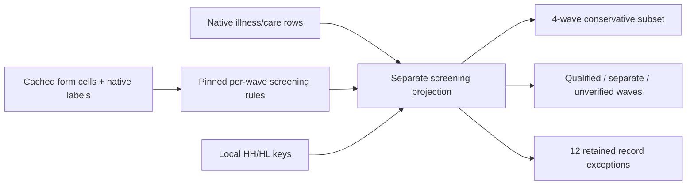

# HEALTH variable brief: recent illness or injury

[Documentation index](README.md) · [HEALTH module](cses-health-module.md) · [Source table preflight](cses-health-illness-preflight.md)

## Result and scope

Publication follow-up: this preserved screening projection is included in the separate
[HEALTH database release](cses-health-database-release.md). The analysis entry point is
`cses_analysis.cses_health_illness_v1`, using `strict_screening_eligible` for the conservative subset.
The local-stage statements below remain historical; they do not describe the new publisher.

The first HEALTH concept has a reproducible **local semantic crosswalk**, not a published database
variable. All ten illness/care sources were checked: **358,859 person-wave records** are retained.
There is **no all-ten-wave equivalence claim**. No PostgreSQL connection/write, source modification,
Git commit or DVC push was performed for this review.

`recent_illness_injury_30d` means the household proxy reports that a usually resident member is sick,
has an illness or injury now or at any time in the last 30 days. Values are `1 = yes`, `0 = no`,
and null when missing or the period/meaning is not established. This is not a clinical diagnosis.
The reporting adult is usually the household head/spouse, with the form's adult fallback; counts
refer to household members represented in the data, not people personally interviewed.

Four waves have form-supported 30-day mappings: **2009, 2013, 2016 and 2021**. Their conservative
local subset contains **134,977 person-wave records**, including **20,620 yes responses**. These
are unweighted record totals across repeated cross-sections, not a population count, a longitudinal
cohort or an estimated prevalence. Form-supported semantics do not certify every record as clean.

## Coverage, codes and usable records

| Wave | Native field | Observed original codes and counts | Decision | Conservative usable rows |
| --- | --- | --- | --- | ---: |
| 2004 | `q14a06` | 1: 14,009; 2: 60,612; 9: 98 | Separate broader 28-day question; 9 explicitly means missing | 0 |
| 2007 | `q14ac06` | 1: 2,612; 2: 14,789 | Unlabelled candidate; household form not located | 0 |
| 2009 | `q13bc02` | 1: 8,344; 2: 48,738 | Form-supported: 1 yes, 2 no | 57,082 |
| 2011-12 | `q13bc2a` | 1: 2,584; 2: 13,743 | Qualified: distributed 2011 form, no separate 2012 confirmation | 0 |
| 2013 | `Q13BC2A` | 1: 2,977; 2: 14,248 | Form-supported: 1 yes, 2 no | 17,225 |
| 2014 | `q13bc2a` | 1: 7,822; 2: 46,146 | Qualified: draft questionnaire, not verified final form | 0 |
| 2016 | `q13bc2a` | 1: 2,503; 2: 14,482 | Form-supported; exclude 3 unlinked people and 1 branch conflict by default | 16,981 |
| 2017 | `Q13BC2A` | 1: 2,422; 2: 14,487 | Unlabelled candidate; no health-specific 2016 transfer | 0 |
| 2019 | `q13bc2a` | 1: 7,354; 2: 150; 3: 37,044 | Native labels establish illness/injury/no; period/universe not yet verified | 0 |
| 2021 | `q13bc2a` | 1: 6,661; 2: 136; 3: 36,898 | Form-supported: 1 or 2 yes, 3 no; exclude 6 branch conflicts by default | 43,689 |

Zero usable rows here means exclusion from the **conservative default**, not absence of data or
absence of illness. 2011-12 and 2014 have qualified 30-day candidates preserved for an explicitly
qualified analysis; they are not silently mixed into the default subset. All screening fields have
non-null native values, but the 98 explicit 2004 missing codes are **not valid answers**.

### Why direct stacking would be wrong

- **Code 2 changes meaning:** no in the older verified binary forms; injury in 2019/2021. The latter
  native labels are `Diseases`, `Injury`, `No`. 2021 printed options independently confirm this.
- **2004 differs in more than time:** the prompt includes "other health problem" over four weeks,
  and the next question includes antenatal/postnatal/other care needs. It is not simply a 30-day
  illness variable with two days missing. The source binary interpretation stays separate.
- **Printed suffixes differ in 2011/2013/2014:** screening/type are printed `(2)/(2a)` but native
  fields are `2a/2b`. Position, observed 1/2 screening codes, adjacent 1–5 illness-type codes and
  chronic-illness 1/2 codes support the mapping. Exact field-name matching alone would be wrong.
- **2007/2017 code patterns are not semantic proof.** The matching branch distributions are retained
  as supporting evidence, not an authorization to inherit another wave's health questionnaire.
- **2019 is partially interpretable, not wholly aligned.** `native_screen_present` uses its native
  labels, but the truncated question label does not supply a reference period. The copied image-based
  Word bundle has not yet been transcribed for this item; the 30-day candidate remains null.

## Record-quality checks and denominators

Seven unique records have checked screening-branch inconsistencies:

- **2016: 1** says no but has a nonempty illness-type response.
- **2021: 5** say no but have information in a skipped illness branch; **1** says injury but has
  an illness-only type response. These sets are disjoint.

Raw answers and mapped answers are retained. A contradictory no is **not changed to yes**.
`strict_analysis_eligible` excludes these seven records and requires a matched household and roster
person, a mapped 30-day response, and `alignment_status == 'form_supported'`.

The previous **5 HL-unmatched people** are retained (2 in 2014, 3 in 2016), with no household
conflicts. Combined with seven branch-conflict records, the exception file contains **12 records**.
The **66 roster members without illness-source rows** remain absent from the health artifact, never
imputed as healthy: 38 in 2007, 23 in 2009, 2 in 2014 and 3 in 2016. These are separate from the five
health-source people absent in HL. The denominator is therefore not automatically the full roster.

Branch checks are limited to the screening item's adjacent skipped questions. Missing or invalid
downstream values are not all adjudicated here, and illness type, duration, treatment and costs are
**not yet harmonized**. For example, the observed 2021 activity-limitation field includes code 6,
outside its printed 1–3 domain; this belongs in the next downstream review, not a silent screen recode.

## Evidence, artifacts and reproduction

- [Crosswalk specification](../rsc/specs/cses_health_recent_illness_v1.json)
- [Review implementation](../rsc/cses_db/review_cses_health_recent_illness.py)
- [Generated brief and per-wave aggregate checks](../data/processing/cses/health_recent_illness_v1/README.md)
- [Machine-readable question/cell evidence and native-code profiles](../data/processing/cses/health_recent_illness_v1/wave_review.json)
- [Source-row screening projection](../data/processing/cses/health_recent_illness_v1/screening.parquet)
- [Retained exception records, DVC-owned and not for public reports](../data/processing/cses/health_recent_illness_v1/review_exceptions.parquet)
- [Inputs, implementations and artifact fingerprints](../data/processing/cses/health_recent_illness_v1/manifest.json)

The original questionnaires were read through the verified extracted cell library, without opening
source archives or editing workbooks. The spreadsheet research workflow kept original observations
separate from derived values and explicit quality flags. Exact source/form hashes, original paths,
sheet names, question/option/universe/number cells and surrounding header context are recorded.

```bash
.venv/bin/python rsc/cses_db/review_cses_health_recent_illness.py
.venv/bin/pytest -q rsc/tests/test_cses_health_recent_illness.py
```

The builder checks the complete local health/questionnaire caches and local HH/HL key projections,
then refuses to overwrite any differing artifact. Use a new version directory for later decisions.
The earlier 14-column source-table preflight and its native records remain unchanged; the new
projection is separate. Database publication still needs the separately documented registry,
lineage, transactional loader and verification workflow.

For local analysis, read `screening.parquet`, filter `strict_analysis_eligible == True`, then group
by `survey_wave`. Retain source keys when joining weights/design fields; validate cardinality and
the analytical universe. Do not treat missing weights as one or calculate pooled prevalence by
dividing the aggregate yes count above by all ten waves' source rows.



This is local processing lineage. The published database topology remains graph v14.

## Next bounded step

Review **illness type** and its changing category lists, using the screened population and the
separate injury branch. Also resolve the 2019 image-form evidence and the
2007/2017 missing-form gaps before expanding the strict screening coverage. No full ten-wave
alignment is implied by completing this first local crosswalk.

## Verification record

The complete suite passed **413 tests**, including 16 new screening tests. Ruff and Git whitespace
checks passed. Independent checks matched every native screening value and source-row locator
across all 358,859 records, reconciled the 134,977-record subset and its 20,620 yes answers, verified
all recorded artifact/dependency hashes and all ten brief links, and confirmed protected published
EC fingerprints were unchanged. A second build reproduced the same immutable artifacts and manifest.
