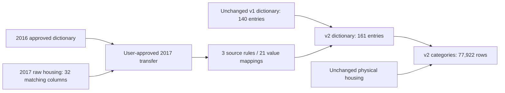

# Housing 2017 aligned to the approved 2016 dictionary

This is the preserved v2 release. For current database validation and the additive v3 interface,
see [recovered 2007/2013 evidence](cses-housing-recovered-evidence.md). The v2 validator remains
frozen and intentionally rejects the later expanded metadata catalog; the 2017 decision is unchanged.

Status: published and independently validated in `mda`; graph v8 exported twice identically.
See the [release record](releases/cses-housing-2017-from-2016-v1.md). Git/DVC archival is pending.

## Decision and boundary

On 2026-09-05 the user explicitly instructed: “如果数据结构一致就直接用2016对齐就好了”.
Release `cses-housing-2017-from-2016-v1` applies this decision to the three housing source-code
variables under discussion: tenure, cooking fuel and lighting. It does not transfer the semantics
of every 2017 section, change raw values, or claim that a 2017 questionnaire has been recovered.

The 2016 and 2017 raw housing files have identical ordered sets of **32 columns after case
normalization**. Original capitalization remains preserved. Every 2017 observed code occurs in the
approved 2016 dictionary. All 3,840 source rows and the three code fields reconcile exactly with
the local housing release using one-based source-row IDs and exact archive/member identities.

## Transferred definitions

| Field | Adopted 2016 options | Options observed in 2017 | Matched 2017 records | Preserved NULL |
| --- | ---: | ---: | ---: | ---: |
| Dwelling tenure | 4 | 3 | 3,839 | 1 |
| Main cooking fuel | 8 | 5 | 3,840 | 0 |
| Main lighting source | 9 | 8 | 3,840 | 0 |

The 21 entries include five options with zero 2017 observations. Their presence describes the
adopted dictionary, not evidence that those responses were observed. All 11,519 non-null values
across the three target columns receive the adopted definitions. Source NULL is never assigned a
substantive category.

The semantic status is **approved by user decision**, with evidence basis
`user_approved_cross_wave_transfer`. Reference year, 2016 question/option evidence, historical
qualifications, target archive/member hashes and the user's decision remain inspectable.
`target_questionnaire_verified=false` and source Stata labels remain NULL. Approval of the
cross-wave assumption is separate from verification of a target-wave questionnaire.

## Additive database interface

Publication adds one alignment release, three versioned source rules, 21 value mappings and one
successful load-run record. It creates two new views without replacing either v1 view:

- `cses_analysis.cses_housing_value_dictionary_v2`: 140 unchanged v1 entries plus 21 transferred
  entries, for 161 total.
- `cses_analysis.cses_housing_categories_v2`: all 77,922 housing records and 66 columns, including
  the unchanged 50 physical source columns. The 19 unmatched HH records remain visible.

The composite category view has `housing_dictionary_version='cses-housing-interface-v2'`. The
dictionary's `dictionary_version` identifies each row's actual release; 2017 points to the new
transfer release and the existing seven covered waves still point to their v1 dictionary release.
No source labels or question-link records are synthesized.

```sql
BEGIN READ ONLY;
SELECT survey_wave, tenure_match_status, cooking_fuel_match_status, lighting_match_status, count(*)
FROM cses_analysis.cses_housing_categories_v2
WHERE survey_wave = '2017'
GROUP BY 1, 2, 3, 4;

SELECT canonical_name, source_value, category, label, dictionary_version,
       evidence->>'approval_basis' AS approval_basis,
       evidence->>'target_questionnaire_verified' AS target_questionnaire_verified
FROM cses_analysis.cses_housing_value_dictionary_v2
WHERE survey_wave = '2017'
ORDER BY canonical_name, source_value;
ROLLBACK;
```

## Operations and verification

```bash
.venv/bin/python rsc/cses_db/publish_cses_housing_2017.py plan --root .
.venv/bin/python rsc/cses_db/publish_cses_housing_2017.py prepare --root . \
  --backup-dir /Volumes/MikesDataBackup/PG_DB
.venv/bin/python rsc/cses_db/publish_cses_housing_2017.py apply --root . \
  --apply --execution-sha256 <literal execution manifest SHA-256>
.venv/bin/python rsc/cses_db/publish_cses_housing_2017.py validate --root .
.venv/bin/python rsc/cses_db/publish_cses_housing_2017.py export --root .
```

Preparation validates the historical v1 interface, the raw/source contract, predecessor identities
and SQL plans. Two external custom-format backups cover the four affected metadata tables and
the pre-existing analysis-schema definitions. Each backup is decompressed and hashed.

The publication transaction locks all 35 protected physical tables, rejects unexpected triggers,
and compares complete existing-row fingerprints and relation definitions/privileges before and
after. Only the new release's metadata and the two new views are excluded from those comparisons.
All 140 old dictionary rows and every resulting category/evidence association are checked; the
50 original columns are compared cell by cell with the pinned local Parquet. Failure rolls back
the transaction. An exact retry checks existing records instead of inserting duplicates.

An independent read-only validation binds the execution and import evidence. The old v1
validator intentionally rejects the expanded catalog; it remains immutable historical logic.
Use the new validator for current state after publication.

Evidence is stored in `data/releases/cses-housing-2017-from-2016-v1/`. Graph v8 and
`cses_housing_interface_topology_v2.json` preserve earlier graph files and explicitly connect the
2016 donor dictionary release to the 2017 transfer decision. The following topology illustrates
that provenance; it does not assert direct 2017 questionnaire evidence.



Code and outputs are fingerprinted without inventing an archived Git/DVC revision. Git commits
and DVC synchronization remain separate user-requested operations. The recovered 2007 code tables
and 2013 questionnaire are separate follow-up releases, not silently included here.
