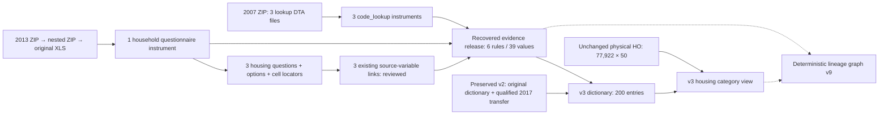

# Housing evidence recovery: 2007 and 2013

This is preserved v3 history. Current v4 validation and the subsequent 2021 resolution are in
[the current runbook](cses-housing-2021-resolution.md). The frozen v3 validator rejects later
catalog expansion by design; do not weaken it or overwrite its evidence.

Release: `cses-housing-recovered-evidence-v1`. Published and independently validated in `mda` on
2026-09-05. Graph v9 was exported twice with identical bytes (4,828 nodes, 7,600 edges).
All 113 tests passed. See the [release record](releases/cses-housing-recovered-evidence-v1.md).
Git/DVC archival remains pending.

## Scope and evidence

The user approved completing the recovered primary evidence for the three housing fields already
under discussion: dwelling tenure, main cooking fuel and main lighting source. This is not a
whole-questionnaire variable harmonization or a change to respondent data.

| Wave | Primary evidence registered | Tenure options | Cooking options | Lighting options | Non-null values matched |
| --- | --- | ---: | ---: | ---: | ---: |
| 2007 | Three independent English Stata code-lookup tables | 4 | 8 | 7 | 10,769 |
| 2013 | Recovered English household questionnaire inside a nested ZIP | 4 | 8 | 8 | 11,520 |

The 39 option definitions include five options not observed in these housing records. All 34
observed field/code combinations are covered. The 2007 source has 3,593 housing rows with three
tenure, five cooking and two lighting NULLs; the 2013 source has 3,840 rows and no NULL in these
three fields. Missing values are retained, not given a substantive category.

The 2007 sources reside in `CSES 2007/HH data/CSES 2007/code/` within
`data/raw/CSES 2007.zip`: `dbo_c_legalstatus.dta`, `dbo_c_fu.dta`, and
`dbo_c_lightingsource.dta`. Their `descr_eng` rows are explicit code definitions, not embedded
value labels of the housing file. They are registered as `code_lookup` instruments with no
fabricated question text or question links. A 2007 household questionnaire is still not recovered.

The full 2013 instrument identity is
`data/raw/CSES2013.zip::CSES2013/CSES2013/CSES 2013.zip::CSES2013 HH Questionnaire ENG.xls`.
The original workbook has 24 sheets. The registry now includes the whole source workbook, but
only these three questions from `04 Housing` are cataloged and linked to source variables:

| Source variable | Question code / text cells | Option cells |
| --- | --- | --- |
| `Q04_07` | `A33` / `B33` | `C35`, `N35`, `U35`, `AC35` |
| `Q04_22A` | `A122` + part `C122` / `D122` | `B124`, `O124` |
| `Q04_24` | `A158` / `C158` | `D160` |

Legacy XLS conversion runs in an isolated temporary directory. The spreadsheet read-only workflow
preserves the original archive and workbook fingerprints; converted XLSX files are not registered
as sources or delivered as new workbooks. Raw cell text, coordinates, option lines and printed skip
instructions are retained in `source_evidence.json`. Whitespace/apostrophe-normalized question text
has `is_exact_question_text=false`; the three source links are `reviewed`, `direct_response`.

Meanings are checked against each wave's actual evidence. In particular, lighting code **7 is
Other in 2007, but Solar in 2013**; 2013 code 8 is Other. The release does not borrow 2016 semantics.
The approved canonical vocabulary is reused only after this explicit option-level comparison.
`source_label` stays NULL because neither housing file embeds Stata value labels; actual source
wording remains available in the evidence object.

## Additive v3 interface

- `cses_analysis.cses_housing_value_dictionary_v3`: 161 unchanged v2 entries plus 39 recovered
  entries, for 200 definitions covering three fields across all ten waves.
- `cses_analysis.cses_housing_categories_v3`: 77,922 rows, 66 columns, retaining all 50 physical
  housing columns and all 19 unmatched HH records. `housing_dictionary_version` is
  `cses-housing-interface-v3`; dictionary rows retain their actual individual release version.

Publication inserts 54 metadata records: one release, six source rules, 39 value mappings, one
load run, four instruments and three questions. It updates only the three formerly empty 2013
source-question links. It adds two views with SELECT for `mda_readonly`, without replacing v1/v2,
changing physical data, or creating a schema, physical table or compatibility view.

The 2017 user-approved 2016 transfer remains unchanged and explicitly qualified. Six 2021 lighting
observations in one unresolved lighting code remain `unmapped_nonnull`; the separately unresolved
raw 2021 tenure code 0 remains subject to the existing source-code-to-NULL processing, unchanged here.
Existing draft, skip, compound,
residual and denominator qualifications remain in force. This does not certify every housing field,
every section, or common cross-wave analytical eligibility.

```sql
BEGIN READ ONLY;
SELECT survey_wave, canonical_name, source_value, category, label,
       dictionary_version, evidence->>'evidence_type' AS evidence_type,
       evidence->>'source_file' AS source_file
FROM cses_analysis.cses_housing_value_dictionary_v3
WHERE survey_wave IN ('2007', '2013')
ORDER BY survey_wave, canonical_name, source_value;

SELECT survey_wave, lighting_match_status, count(*)
FROM cses_analysis.cses_housing_categories_v3
GROUP BY survey_wave, lighting_match_status
ORDER BY survey_wave, lighting_match_status;
ROLLBACK;
```

Select only needed household columns; inspect repeated evidence JSON through the compact dictionary.

## Provenance topology



## Reproduction and current validation

The extractor and local plan do not access PostgreSQL. Existing different output is rejected,
not overwritten. Inputs and implementation are hash-bound to the execution manifest.

```bash
uv run python rsc/cses_db/extract_cses_housing_recovered_evidence.py --root .
uv run python rsc/cses_db/publish_cses_housing_recovered.py plan --root .
```

The publisher's `prepare --backup-dir /Volumes/MikesDataBackup/PG_DB` first validates v2, checks
empty target names/links and prospective query plans, fingerprints all 35 physical CSES tables and
existing view structures, and takes verified external backups of the seven affected metadata tables
plus `cses_analysis` definitions. `apply --apply --execution-sha256 <literal verified hash>` uses
a scoped transaction, locks, trigger checks, exact record/coverage comparisons and reader tests.
The preservation comparison excludes only the new records/views and masks only the three authorized
link columns on exactly the three target source rows; all other columns and existing rows remain
protected. A failed check rolls back database changes. Do not restore backups over newer state without
a separately reviewed recovery scope. An exact apply retry validates the already published state;
it does not replace existing records or views.

After publication, use the new validator and exporter:

```bash
uv run python rsc/cses_db/publish_cses_housing_recovered.py validate --root .
uv run python rsc/cses_db/publish_cses_housing_recovered.py export --root .
```

Validation uses a fresh read-only transaction and checks all original housing cells, every category
match/evidence object, per-wave coverage, exact registry additions/links, old protected state and
new view identities/ACLs/definitions. Graph v9 preserves prior view topology and the 2017 decision
edge, adds actual v3 dependencies and four recovered-instrument evidence edges. Repeat exports must
be byte-identical. Earlier validators and reports remain frozen historical-state checks; they are
expected to reject this expanded catalog and must not be weakened.

Evidence lives under `data/releases/cses-housing-recovered-evidence-v1/`; graph and dependencies are
`data/lineage/cses_lineage_graph_v9.json` and `cses_housing_interface_topology_v3.json`.
Git/DVC synchronization is a separate requested operation, not part of this publication.
