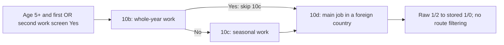

# Main job performed in a foreign country

`main_job_was_abroad` (`q15_c10d`, case varies) is already stored in the physical EC table and the current `cses_analysis.cses_ec_classification_v1` view. **20 of 39 EC fields have now been reviewed; 19 remain.** Reviewed means detailed evidence and value checks, not that every year is fully comparable.

## Meaning and choices

Five complete inspected questions ask whether the person’s main occupation/economic activity is done in a foreign country. The existing name is consistent with that meaning. There are **two choices: raw 1 = Yes, raw 2 = No; stored 1 = Yes, stored 0 = No**. NULL is not No. The item concerns the location of the main job, not nationality, migration status or employment by a foreign-owned company inside Cambodia. It belongs to the current/past-seven-days employment block, including its temporary-absence route; the question does not independently measure days spent abroad.

## Availability

Across 332,903 EC member-wave records there are **123,829 non-null values: 3,086 Yes and 120,743 No**. These are unweighted member-wave observations, not actual interview respondents or unique people followed across years.

| Wave | EC records | Yes | No | Non-null | NULL | Question evidence |
| --- | ---: | ---: | ---: | ---: | ---: | --- |
| 2004 | 74,719 | 0 | 0 | 0 | 74,719 | No exact column in selected source |
| 2007 | 15,766 | 0 | 0 | 0 | 15,766 | No exact column in selected source |
| 2009 | 51,460 | 0 | 0 | 0 | 51,460 | No exact column in selected source |
| 2011-12 | 14,829 | 155 | 9,850 | 10,005 | 4,824 | Complete selected question |
| 2013 | 15,774 | 237 | 9,706 | 9,943 | 5,831 | Complete selected question |
| 2014 | 49,252 | 1,046 | 30,114 | 31,160 | 18,092 | Draft complete question |
| 2016 | 15,498 | 257 | 9,851 | 10,108 | 5,390 | Complete selected question |
| 2017 | 15,482 | 280 | 9,774 | 10,054 | 5,428 | Source column present; household question unverified |
| 2019 | 40,379 | 717 | 26,026 | 26,743 | 13,636 | Truncated foreign-country wording + Yes/No labels; route unverified |
| 2021 | 39,744 | 394 | 25,422 | 25,816 | 13,928 | Complete selected question |

The exact raw alias is absent from the selected 2004, 2007 and 2009 current-employment data. No abroad item was found by the recorded phrase/item search in the selected 2004/2009 English current-employment sheets. These are scoped findings, not proof that no related information exists anywhere. 2017 lacks verified household question evidence. Unlike seasonal 10c, the 2019 Stata label retains the meaningful phrase “done in a foreign co”, supporting the foreign-country interpretation, but it is still truncated and does not establish the complete question or route. No route is borrowed for either year and no full cross-wave certification is asserted. The 2014 form remains a draft.

## Routing and exceptions

Question 10d has its own literal gate: age 5+ and first work-screen Yes **OR** second work-screen Yes. It does **not** require whole-year No, a seasonal Yes/No, or even a non-null seasonal response. Whole-year Yes explicitly skips 10c and goes to 10d. Do not filter this variable using the preceding seasonal item’s route.

The 2021 printed gate still mentions temporary absence although the revised second screen asks about unpaid work. The numeric OR condition is retained as a literal diagnostic, with the wording conflict unresolved. Responses outside the route are kept, not overwritten or treated as proof that the gate is wrong.

| Wave | Literal route | Non-null inside | Non-null outside | Non-null, route unknown | NULL inside route |
| --- | ---: | ---: | ---: | ---: | ---: |
| 2011-12 | 10,105 | 10,005 | 0 | 0 | 100 |
| 2013 | 9,950 | 9,943 | 0 | 0 | 7 |
| 2014 | 31,279 | 31,158 | 1 | 1 | 121 |
| 2016 | 10,150 | 10,107 | 1 | 0 | 43 |
| 2021 | 25,820 | 25,812 | 4 | 0 | 8 |

In the five inspected-question waves, 6 non-null values are outside the literal route, 1 have an unknown route, and 279 eligible records have no stored answer. These are diagnostics rather than a certified analytical denominator.

Those five waves include 57,996 non-null abroad responses with whole-year Yes, and 58,139 with a missing seasonal response. These groups overlap and must not be added. Neither pattern is itself a skip violation for 10d. The two pre-existing unmatched EC→HL records remain; missing age can make route eligibility unknown.

The inherited binary conversion excluded 3 non-null raw codes from 123,832 original non-null codes. The review records the exact raw frequencies and any exclusions. No new recoding or imputation is applied.

| Wave | Excluded raw codes |
| --- | --- |
| 2019 | 4.0: 2, 8.0: 1 |

## Source locators and verification

| Wave | Raw variable | Sheet | Text / code / options | Gate |
| --- | --- | --- | --- | --- |
| 2011-12 | q15_c10d | 15 Econo_Status_1 | CR10 / CR19 / CR15 | CR6 |
| 2014 | q15_c10d | 15 Econo_Status_1 | CM12 / CM19 / CM17 | CM6 |
| 2013 | Q15_C10D | 15 Econo_Status_1 | CM12 / CM19 / CM17 | CM6 |
| 2016 | q15_c10d | 15 Econo_Status_1 | CM12 / CM19 / CM17 | CM6 |
| 2021 | q15_c10d | 15 Current Econo-2 | T17 / T24 / T22 | T11 |

The [aggregate review](../data/processing/cses/main_job_abroad_review_v1/review.json) includes exact question/option/gate text, source-variable and candidate identities, seven raw-field reproductions, fresh Stata labels, hashes and ten field-wave profiles. The spreadsheets skill guided separate wording, choice and skip checks. All seven selected original workbooks were freshly re-extracted, with every sheet matching the frozen evidence and no original workbook edits.

A forced read-only transaction matched all 13 selected columns across 332,903 rows in both the physical EC table and current classification view. This includes the reviewed value, whole-year/seasonal context and identity/provenance. It is not a full 86-column view validation.

The diagram describes the five inspected forms, with the 2014 draft and 2021 gate qualification above. It is not a new database topology. Published graph v14 and all prior database objects/releases remain unchanged. No interpretation overlay, question-link publication, Git commit or DVC push is performed.

Reproduce with bundled Python: `rsc/cses_db/review_cses_main_job_abroad.py --verify-workbooks --soffice /path/to/bundled/soffice`, then `.venv/bin/python rsc/cses_db/review_cses_main_job_abroad.py --check-database`. Use fresh `--output` and `--docs-dir` paths for changed snapshots.

The next useful review is additional job count (`additional_jobs_count`), separating it from total occupation count before using it to gate secondary-job fields.
