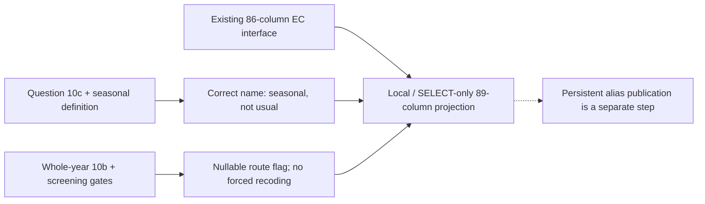

# Main-job seasonality: corrected meaning and local alignment

The legacy field `main_job_was_usual_past_7_days` is misnamed: the directly verified source question `q15_c10c` asks whether the main job is **seasonal**, not usual. **The stored binary polarity is correct: raw 1 = Yes maps to 1, raw 2 = No maps to 0. Do not invert it.** The local semantic projection introduces `main_job_is_seasonal_reported` while preserving all 86 columns of the current database interface. The database old column and metadata have not been renamed, and no persistent database view is created by this review.

EC review coverage is now **19 of 39 fields**, with 20 remaining. This is one newly reviewed source field; the three local projection columns are not three additional reviewed variables.

## Meaning and skips

Five inspected forms define seasonal work as work performed during only part of the year, with the same job recurring every year. Question 10c refers to the main occupation/economic activity during the past seven days and has two Yes/No choices. It follows whole-year item 10b only when the raw answer to 10b is 2 (canonical 0). A whole-year Yes skips 10c and goes to 10d. Seasonal is therefore not the inverse of whole-year work; do not fill a skipped 10c with 0 or 1.

The literal route is age 5+, first OR second work screen Yes, and whole-year No. The 2014 form is a draft. The 2021 inherited gate still mentions temporary absence even though the second screen asks about unpaid work; this wording conflict remains unresolved. Neither equal binary codes nor this literal route certify an identical cross-wave statistical population.

## Availability and evidence scope

The old stored field has **38,176 non-null member-wave values** across seven waves: 28,138 Yes and 10,038 No. The explicitly evidence-qualified local alias has **29,061 non-null values** in five questionnaire-supported waves, including the labelled 2014 draft scope. These are unweighted records, not actual interview respondents or unique humans followed across years.

| Wave | EC records | Stored Yes (1) | Stored No (0) | Stored non-null | NULL | Seasonal meaning evidence |
| --- | ---: | ---: | ---: | ---: | ---: | --- |
| 2004 | 74,719 | 0 | 0 | 0 | 74,719 | No selected source column |
| 2007 | 15,766 | 0 | 0 | 0 | 15,766 | No selected source column |
| 2009 | 51,460 | 0 | 0 | 0 | 51,460 | No selected source column |
| 2011-12 | 14,829 | 3,183 | 1,228 | 4,411 | 10,418 | Verified question/definition |
| 2013 | 15,774 | 3,011 | 813 | 3,824 | 11,950 | Verified question/definition |
| 2014 | 49,252 | 8,868 | 2,457 | 11,325 | 37,927 | Draft question/definition |
| 2016 | 15,498 | 1,661 | 479 | 2,140 | 13,358 | Verified question/definition |
| 2017 | 15,482 | 1,553 | 479 | 2,032 | 13,450 | Household question unverified |
| 2019 | 40,379 | 5,024 | 2,059 | 7,083 | 33,296 | Yes/No labels; question text truncated |
| 2021 | 39,744 | 4,838 | 2,523 | 7,361 | 32,383 | Verified question/definition |

**2019 limitation:** fresh Stata metadata establishes Yes/No option labels, but its variable question label is truncated before the word seasonal. It does not independently establish the full question meaning; the household image-form transcription is still pending. 2017 also lacks a verified household question. Their original 7,083 and 2,032 stored values remain available under the legacy field, but the evidence-qualified alias is NULL for those waves. This is withholding an unsupported semantic assertion, not deleting data or claiming that the source did not ask the question. 2004/2007/2009 selected current-employment sources lack the exact alias; nothing is borrowed from other modules or years.

## Whole-year and route exceptions

Across the seven source-bearing waves, 165 records have both whole-year Yes and a non-null 10c answer; 49 have Yes in both fields. These are response-pair diagnostics. In the five verified forms they violate the printed 10b bypass. For 2017/2019 the route is unverified, so a contradiction in their questionnaire is not asserted. Source answers are preserved in all cases.

| Wave | Whole-year Yes + any 10c | Yes in both | Whole-year No + missing 10c | Whole-year unknown + 10c | Literal route records | Non-null outside route | Non-null, route unknown |
| --- | ---: | ---: | ---: | ---: | ---: | ---: | ---: |
| 2011-12 | 0 | 0 | 8 | 2 | 4,417 | 0 | 2 |
| 2013 | 0 | 0 | 14 | 0 | 3,838 | 0 | 0 |
| 2014 | 77 | 19 | 191 | 13 | 11,425 | 78 | 13 |
| 2016 | 13 | 0 | 36 | 1 | 2,161 | 14 | 1 |
| 2017 | 11 | 1 | 61 | 2 | Not assessed | Not assessed | Not assessed |
| 2019 | 33 | 13 | 6 | 0 | Not assessed | Not assessed | Not assessed |
| 2021 | 31 | 16 | 2 | 0 | 7,331 | 32 | 0 |

The local reported alias is **not route-filtered**: reported values outside the route remain visible alongside a separate nullable route flag. A downstream analysis must state its denominator/exception policy rather than silently deleting or imputing these cases. NULL can indicate no selected source, a skipped/unanswered question, or insufficient semantic evidence in the new alias; consult both the legacy value and evidence status.

## Local alignment outputs

| New local column | Contract |
| --- | --- |
| `main_job_is_seasonal_reported` | Legacy 1/0 copied without inversion in 2011-12, 2013, 2014, 2016 and 2021 only; NULL elsewhere |
| `main_job_seasonal_evidence_status` | Verified questionnaire, draft questionnaire, unverified 2017 semantics, truncated 2019 label, or no selected source |
| `main_job_seasonal_literal_route` | Nullable literal-route diagnostic for the five inspected forms; NULL where the route is unverified |

The [versioned local Parquet](../data/processing/cses/main_job_seasonal_review_v1/local_semantic_projection.parquet) contains 332,903 rows and 89 columns. It is **not** a new database table or a replacement for the canonical release. The [read-only SQL projection](../rsc/sql/cses_main_job_seasonal_projection.sql) returns the same corrected names directly from the existing mda view, without CREATE/ALTER/UPDATE statements. New alias columns exist in the query result, not persistently in mda.

## Source locators and verification

| Wave | Source variable | Sheet | Text / code / options | Gate / definition |
| --- | --- | --- | --- | --- |
| 2011-12 | q15_c10c | 15 Econo_Status_1 | CM7 / CM19 / CM15 | CM6 / CM11 |
| 2014 | q15_c10c | 15 Econo_Status_1 | CI7 / CI19 / CI17 | CI6 / CI12 |
| 2013 | Q15_C10C | 15 Econo_Status_1 | CI7 / CI19 / CI17 | CI6 / CI12 |
| 2016 | q15_c10c | 15 Econo_Status_1 | CI7 / CI19 / CI17 | CI6 / CI12 |
| 2021 | q15_c10c | 15 Current Econo-2 | P12 / P24 / P22 | P11 / P17 |

The [aggregate review](../data/processing/cses/main_job_seasonal_review_v1/review.json) preserves raw-variable identities and hashes, the exact seasonal definitions, adjacent whole-year gates, fresh Stata labels and ten field-wave profiles. Seven original English workbooks were freshly extracted and every sheet matched the frozen cells. The spreadsheets skill guided separate checks of wording, option polarity and skips, with original workbooks unchanged.

All seven seasonal raw-field transformations and all seven whole-year dependencies were independently reproduced. The source has 38,189 non-null seasonal codes; the inherited 1/2 conversion excludes 13 nonbinary codes, leaving 38,176 stored non-null values. These exclusions predate this review: original archive values are preserved, but neither the legacy binary column nor the new reported alias carries the invalid raw codes. No unsupported Yes/No interpretation is assigned.

| Wave | Raw seasonal codes excluded by inherited conversion |
| --- | --- |
| 2019 | 0.0: 7 records, 3.0: 4 records, 6.0: 1 records |
| 2021 | 3.0: 1 records |

Forced read-only database comparisons matched all 12 selected columns in the physical EC table and current classification view. The complete proposed 89-column SQL projection also matched the local projection for all 332,903 records. This validates a SELECT result, not publication of a new view.

This local process diagram does not alter published graph v14. Previous reviews, publishers, the 37 physical CSES relations, catalog mappings and historical views remain unchanged. No Git commit or DVC push is performed.

Reproduce with the bundled runtime using `rsc/cses_db/review_cses_main_job_seasonal.py --verify-workbooks --soffice /path/to/bundled/soffice`, then `.venv/bin/python rsc/cses_db/review_cses_main_job_seasonal.py --check-database`. Use fresh `--output`, `--docs-dir` and `--sql-output` paths for a changed snapshot.

The next implementation step is a separately versioned additive database alias with the same explicit evidence/route qualifiers; do not rename the historical column in place. 2017/2019 semantic promotion still requires the missing source-question evidence or a separately approved, explicitly qualified transfer.
