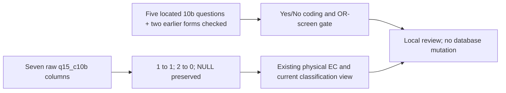

# Main job: works the whole year

`main_job_works_whole_year` is already stored in the original EC table and inherited by the current `cses_analysis.cses_ec_classification_v1` view. This review adds one examined EC field: **18 of 39 reviewed, 21 remaining**. It does not certify unrestricted comparability across all ten waves.

## Meaning and coding

The item asks whether the person works the whole year in their main occupation/economic activity. The five inspected forms containing it have two choices: **raw 1 = Yes, 2 = No; canonical 1 = Yes, 0 = No**. NULL remains unknown/unavailable, not No. The original Stata variable is `q15_c10b` (case varies). The transformation is reproduced for all seven source-bearing waves; absent columns yield NULL in three earlier waves.

This is not a measured count of months worked, proof of 12 months of employment in a specific calendar year, or a direct inverse of seasonal work. Yes skips the separate seasonal item 10c and goes to 10d; No enters 10c. Neither a seasonal classification nor values for the next field are derived here.

## Availability and population

Across 332,903 EC member-wave records there are **124,104 non-null responses: 85,793 Yes and 38,311 No**. These are unweighted records, not actual interview respondents or longitudinally unique people. Non-null availability is not a certified eligible denominator.

| Wave | EC records | Yes (1) | No (0) | Non-null | NULL | Raw variable | Question evidence |
| --- | ---: | ---: | ---: | ---: | ---: | --- | --- |
| 2004 | 74,719 | 0 | 0 | 0 | 74,719 | Not in selected source | Item not found in inspected current-employment form |
| 2007 | 15,766 | 0 | 0 | 0 | 15,766 | Not in selected source | Household form unverified |
| 2009 | 51,460 | 0 | 0 | 0 | 51,460 | Not in selected source | Item not found in inspected current-employment form |
| 2011-12 | 14,829 | 5,683 | 4,417 | 10,100 | 4,729 | q15_c10b | Verified selected form |
| 2013 | 15,774 | 6,112 | 3,838 | 9,950 | 5,824 | Q15_C10B | Verified selected form |
| 2014 | 49,252 | 19,826 | 11,426 | 31,252 | 18,000 | q15_c10b | Draft |
| 2016 | 15,498 | 7,986 | 2,162 | 10,148 | 5,350 | q15_c10b | Verified selected form |
| 2017 | 15,482 | 8,005 | 2,080 | 10,085 | 5,397 | Q15_C10B | Household form unverified |
| 2019 | 40,379 | 19,694 | 7,056 | 26,750 | 13,629 | q15_c10b | Embedded Yes/No labels; form transcription pending |
| 2021 | 39,744 | 18,487 | 7,332 | 25,819 | 13,925 | q15_c10b | Verified selected form |

The 2004/2007/2009 selected current-employment sources have no `q15_c10b` column. No whole-year item was found in the inspected 2004/2009 English current-employment sheets; this is not a claim about every possible archive or module. The recovered 2007 job-index table does not supply this field. 2017 values reproduce the released mapping but lack independently verified questionnaire semantics. 2019 embedded Stata labels establish its 1/2 Yes/No coding, not its untranscribed questionnaire route.

## Routing and limitations

In the five inspected forms, age eligibility is 5+ and the literal item gate is first work screen Yes OR second screen Yes. It is not restricted to first-screen Yes: the hours block explicitly sends its bypass to 10b. No route is borrowed for 2007/2017/2019. The 2014 draft remains provisional.

**2021 wording conflict is retained:** the 10b gate still mentions temporary absence, while the revised second screening question asks about unpaid work. The literal numeric OR condition is recorded for diagnostics, but this does not establish unchanged cross-wave population meaning. No original answers outside a printed route are deleted or overwritten.

| Wave | Literal route records | Non-null inside | Non-null outside known route | Route unknown | Non-null with unknown route | NULL inside route |
| --- | ---: | ---: | ---: | ---: | ---: | ---: |
| 2011-12 | 10,105 | 10,100 | 0 | 0 | 0 | 5 |
| 2013 | 9,950 | 9,950 | 0 | 0 | 0 | 0 |
| 2014 | 31,279 | 31,250 | 1 | 1 | 1 | 29 |
| 2016 | 10,150 | 10,147 | 1 | 0 | 0 | 3 |
| 2021 | 25,820 | 25,816 | 3 | 4 | 0 | 4 |

The inherited 1/2-only conversion discarded 0 non-null raw values in this field. The machine-readable profiles retain the exact discarded values, if any. Route violations are source-data diagnostics, not instructions to change coding. 2004 general sampling weights remain unavailable. The two existing unmatched EC→HL records are retained; missing age can make route eligibility unknown.

## Exact source locators

| Wave | Sheet | Question text | Code | Options | Item gate |
| --- | --- | --- | --- | --- | --- |
| 2011-12 | 15 Econo_Status_1 | CH10 | CH19 | CH15 | CH6 |
| 2014 | 15 Econo_Status_1 | CD12 | CD19 | CD16 | CD6 |
| 2013 | 15 Econo_Status_1 | CD12 | CD19 | CD16 | CD6 |
| 2016 | 15 Econo_Status_1 | CD12 | CD19 | CD16 | CD6 |
| 2021 | 15 Current Econo-2 | K17 | K24 | K21 | K11 |

The [aggregate review](../data/processing/cses/main_job_whole_year_review_v1/review.json) includes question texts, exact options, gate cells, source-variable identities, fresh Stata labels, source hashes and ten field-wave profiles. All seven selected household workbooks were freshly re-extracted and every sheet compared with the frozen cells. Spreadsheet guidance informed the explicit choice/skip checks; no workbook was modified.

A forced read-only comparison matched all 11 selected columns across 332,903 rows in both the physical EC table and current classification view. This is not a full-table or full-view validation.

This is a local review diagram. Published graph v14, all database objects and prior execution-pinned files remain unchanged. No new question links, interpretation overlay, Git commit or DVC push are published.

Reproduce with the bundled Python runtime: `rsc/cses_db/review_cses_main_job_whole_year.py --verify-workbooks --soffice /path/to/bundled/soffice`, then `.venv/bin/python rsc/cses_db/review_cses_main_job_whole_year.py --check-database`. Changed snapshots require a fresh `--output` and `--docs-dir`.

Next review the adjacent main-job seasonal question (`q15_c10c`). Its existing canonical name `main_job_was_usual_past_7_days` does not match the located seasonal wording; that naming/meaning issue is flagged for the next field, not silently fixed in this one-field review.
