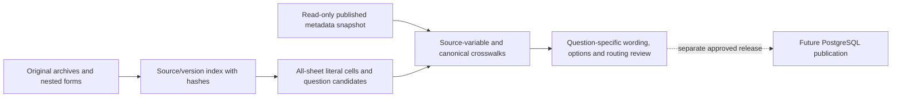

# CSES questionnaires by survey wave and question correspondence

For routine access, start with the new
[extracted local library](../data/processed/cses_questionnaires/v1/README.md).
It contains copied original documents and searchable all-sheet extracts in `data/processed/`;
opening a wave or verifying this cache no longer requires opening ZIP archives. See the
[library and HEALTH guide](cses-health-module.md) for provenance, missing forms and commands.
The workbench and historical counts described below are preserved.

This is the current entry point for organizing questionnaire evidence across all ten CSES waves.
The local workbench separates original sources, extracted question candidates, existing published
links, and newly inspected correspondences. It does not change PostgreSQL or rewrite original files.

Start with the [wave index](../data/processing/cses/questionnaire_alignment_v1/README.md), then open
the relevant wave or one of the seven canonical-table crosswalks. All generated records and full
literal cell extracts are in `data/processing/cses/questionnaire_alignment_v1/`, owned by DVC.
Code, tests and this working guide are Git-owned. This delivery does not run Git/DVC archival.

The subsequent [bounded review](cses-questionnaire-review.md) resolves the 16-item ambiguity queue
and extends the 28 member checks to options, population and routing. It is a separate overlay;
the extraction counts and wording-only results below describe the preserved v1 workbench.

## Evidence by wave

| Wave | Primary questionnaire basis | Limit retained |
| --- | --- | --- |
| 2004 | Registered English V21 household form, village form, diary and listing; other variants preserved | File names do not establish version precedence; duplicate bytes and alternative content are recorded separately |
| 2007 | Registered village questionnaire and three housing code lookups | A household questionnaire has not been recovered; lookup rows are not fabricated question text |
| 2009 | Registered household and village forms and diary, with alternate files preserved | Alternate versions are not silently selected over registered evidence |
| 2011-12 | Distributed 2011 household questionnaire and diary under the combined-wave archive | The document's stated year is not relabeled as a separately verified 2012 instrument |
| 2013 | Original English household workbook recovered inside the nested archive | Only three housing questions were previously registered; other chapters now have local extraction candidates |
| 2014 | Original English draft with WFP comments | Draft status remains provisional, including new local correspondence checks |
| 2016 | Registered English household and village forms | Shared options, eligibility and reference periods require question-specific review |
| 2017 | No located questionnaire in the supplied archive | The approved 2016 transfer remains limited to three housing definitions; no new member or other-section transfer |
| 2019 | Registered English forms DOCX bundle; structural check found 66 embedded media assets and 102 XML text characters | Media count is not question/page count; image-based questions require page transcription, with no automatic OCR approval |
| 2021 | Separate original English and Khmer household workbooks | Languages stay separate; the published lighting conflict and Khmer preference remain explicit |

The scan covers 11 source archives and 76 document/evidence files, including reports and supporting
documents as inventory-only entries and the three registered Stata lookups. It extracts all sheets
of 26 form workbooks. Original archive and file hashes, nested member chains, sheets and cell
locators are preserved. No archive is unpacked into or renamed within `data/raw`.

## What alignment means here

1. The live metadata snapshot preserves 20 instruments, 171 registered questions, 296 existing
   question links, 4,092 source variables, 280 canonical fields and all 1,746 mapping versions/records.
2. Extraction locates 6,766 candidate code occurrences across all versions and repeat headers.
   This is **not** a count of distinct reviewed questions. Numeric row questions and numbered
   column headers are handled separately; the original printed number is retained alongside the
   candidate section/subsection code. The optional native `c` column marker is explicitly represented.
3. Existing canonical associations provide 2,800 field-wave crosswalk rows, covering all 280 fields
   and ten waves. These rows preserve all historical mapping versions rather than selecting the
   largest mapping ID as an effective rule. Derived/context fields may have no direct question.
4. There are 1,156 newly proposed source-variable links: 1,140 have a single candidate wording and
   16 have conflicting candidates. They are not newly published or semantically certified.
   Another 1,110 source variables have no extractable selected questionnaire and 1,530 have no
   numbered-question match. These are workflow states, not proof that a question was never asked.
5. The workbench groups 492 cross-wave wording families as navigation aids only. Identical wording
   does not establish equal response options, universe, units, period, routing or analytical denominator.

All 171 previously registered question texts were rechecked against their original cells using the
recorded whitespace/apostrophe normalization. Composite locators such as `C163+C164` are resolved in
their recorded order; no missing cell is silently treated as a successful comparison.

## First inspected correspondences

The [member-question checks](../data/processing/cses/questionnaire_alignment_v1/member-question-review.md)
cover four topics in seven English source waves, for **28 source-specific checks**. These overlap
the new candidate links above and must not be counted as additional records. Their source identities,
locators, original wording, simple options and retained qualifications are recorded individually.

| Topic | Checked correspondence | Remaining boundary |
| --- | --- | --- |
| Sex | The prompt and `1=Male, 2=Female` agree in the seven inspected forms | Population eligibility still follows each source |
| Age | The question asks age in completed years | Numeric response, not a finite-choice question; missing/boundary codes need a separate data check |
| Relationship to head | The question topic corresponds across the seven forms | This wording check does not certify the complete relationship option lists or their comparability |
| Absence/presence | 2004 asks current absence; later inspected forms ask presence throughout last week | Yes/no polarity and period differ. The existing builder already reverses later coding and retains the period; the two periods are not made equivalent |

The seven waves are 2004, 2009, 2011-12, 2013, 2014, 2016 and 2021. No questionnaire wording is
borrowed for 2007, 2017 or the image-only 2019 source. Local checks retain 2014 draft status and
do not authorize new database records or certify whole-variable harmonization.

## Processing topology



The current work stops at local organization and review. The topology does not add to or overwrite
the accepted PostgreSQL graph v10. The published housing v4 interface and all physical tables remain
unchanged; use the [current housing validator](cses-housing-2021-resolution.md) for that published state.

## Reproduction and next review

Use the project environment for the read-only database snapshot and the bundled artifact runtime
for workbook extraction. Resolve the bundled Python and LibreOffice paths in the local environment;
pass the latter explicitly. XLS conversions use an isolated profile with macros disabled. Native
XLSX/XLSM files are read as literal XML, excluding formula cells. Original source identities never
refer to temporary conversions.

```bash
.venv/bin/python rsc/cses_db/organize_cses_questionnaires.py snapshot \
  --output data/processing/cses/questionnaire_alignment_v1/registry.json

<bundled-python> rsc/cses_db/organize_cses_questionnaires.py extract \
  --snapshot data/processing/cses/questionnaire_alignment_v1/registry.json \
  --output data/processing/cses/questionnaire_alignment_v1 --soffice <bundled-soffice>

<bundled-python> rsc/cses_db/align_cses_questionnaires.py \
  --snapshot data/processing/cses/questionnaire_alignment_v1/registry.json \
  --inventory data/processing/cses/questionnaire_alignment_v1/source_inventory.json \
  --cells data/processing/cses/questionnaire_alignment_v1/source_cells.json \
  --output data/processing/cses/questionnaire_alignment_v1
```

Outputs refuse to overwrite differing historical results. Use a new version directory when sources,
metadata, code or converter change. The manifests bind source bytes, literal cells, snapshot and
implementation hashes. Do not rerun historical publication planners against the expanded catalog.

The 16 ambiguous source links and member relationship options/population/routing have now been
reviewed in the [separate follow-up](cses-questionnaire-review.md). Its newly identified 2004 age
top-code qualification should be addressed before a bounded metadata publication. Education and
employment and page-based 2019 transcription remain later queues. There is no blanket approval
implied by the candidate counts or wording families.

## Verification record

On 2026-09-06 the full suite passed **142 tests**, including 17 new questionnaire organization
tests. Ruff and Git whitespace checks passed. Repeating the final alignment generation against
the same inputs produced identical files; all 21 Markdown documents in this workbench and its guide
were checked for local-link targets without a broken link. The existing housing publication's
implementation/evidence pins also remained intact.

The metadata snapshot SHA-256 is
`127354a1a066bc070daf9dbc1a770bb4bffd3e7d346cba582afabdb7e4f6fda4`.
The alignment JSON SHA-256 is
`60d1f8368c40aeaec1f65597e48729ee6b12cf30761c566be56ecf0d2afd6c19`.
No new questionnaire, question link or value definition was published to PostgreSQL in this step.
