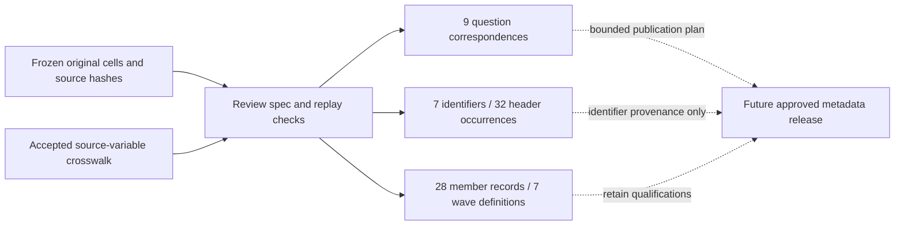

# Questionnaire ambiguity resolution and HH/HL foundations

This is the current local review following the accepted
[questionnaire organization workbench](cses-questionnaire-organization.md).
The original `questionnaire_alignment_v1` package remains unchanged. A separate
`questionnaire_review_v1` overlay records decisions, original locators, options, eligibility,
routing and limitations. No database writes, canonical-data changes or Git/DVC archival occur here.

## Results

- **16 ambiguous source links resolved:** nine interview questions and seven repeated land identifiers.
  The seven identifiers account for 32 printed table-header occurrences. They are not 32 questions.
- **28 member field-wave records reviewed:** sex, age, relationship to head and absence/presence
  in seven available English forms. The full relationship lists have 15 codes, not nine.
- **Seven wave-specific roster definitions recorded:** usual residence and absence under 12 months,
  respondent eligibility, marital/spouse age restrictions, birth-registration eligibility,
  relationship notes, missing-value instructions and absence routing.
- **Three household-form gaps retained:** 2007 and 2017 lack a located household questionnaire;
  2019 needs image-based page transcription. The existing 2017 transfer for three housing definitions
  is not extended to household-member questions. The 2014 English draft remains provisional.

Read the [review summary](../data/processing/cses/questionnaire_review_v1/README.md),
[16 item decisions](../data/processing/cses/questionnaire_review_v1/resolved-queue.md), or
[complete member instructions](../data/processing/cses/questionnaire_review_v1/member-foundations.md).
The [machine-readable review](../data/processing/cses/questionnaire_review_v1/review.json)
includes all selected/rejected/reclassified candidate IDs, nested data-member chains,
source hashes, source cells and publication classifications.

The nine question correspondences are ready for a bounded question-link publication plan.
The seven land identifiers require an identifier-provenance representation rather than invented
interview questions. Within the 28 member records, six sex correspondences are ready for
question-link planning and 22 retain qualifications. These are not whole-variable certifications
or permissions to publish. The other **1,112 nonambiguous candidate source links** remain outside
this review; they do not become approved because the 16-item queue is resolved.

## Important qualifications

| Subject | Evidence | Consequence |
| --- | --- | --- |
| Relationship to head | Codes 1–9 and 10–15 occupy neighboring cells in all seven forms | Preserve the complete 15-code list and each source locator |
| Relationship note | 2011-12, 2013, 2014 and 2016 print “Great/grand child should be reported in other relatives” | Preserve the literal note; do not silently move code-8 grandchildren into code 13 |
| Age | 2004 explicitly records 96 for age 96 or older, and 98 for unknown; the released file also contains 99 | Retain the top-code limitation; questionnaire and released-data sentinels have different evidence |
| Age missingness | Inspected 2009–2016 forms use a dash for unknown age. The 2021 age cell does not specify an unknown code | Do not copy the neighboring birth-date code 98 into an age rule |
| Marital/spouse eligibility | The merged age header spans only the marital/spouse columns: 15+ in 2004, 13+ later | Never apply this cutoff to the whole member roster |
| Birth registration | Added column 5b in the inspected 2014, 2016 and 2021 forms, ages 0–4; four options; age 5+ skips to column 6 | Keep the separate eligibility and probe instruction |
| Absence/presence | 2004 asks current absence; later forms ask presence every day last week | Existing code already reverses polarity and keeps the reference period. Periods are not equivalent |
| Absence duration | 2004 uses months, including 90 for always present. Later forms use weeks and yes-to-presence skips to the next person | Do not convert a structural skip into zero weeks absent over the year |
| 2021 absence reason | An additional question 15 provides five reasons for absence | Do not copy the older question-14 “next person” instruction into this form |
| Household size | The existing HH builder counts released HL roster members, including absent members | The denominator is not people present in the last week; no new filtering is introduced |

These describe the printed questionnaires and current code. They do not certify row-level compliance
with every skip or prove that every released record meets the membership definition. Household-head
selection continues to require a unique relationship code 1; printed instructions to list the head
first do not authorize imputing a missing head. Existing orphan and missing-link issues remain recorded.

## Newly identified age-top-code issue

The original 2004 form, `01 Initial!AA9`, says that **96 means 96 years or more**.
The released roster has three such members and no top-coded household heads. The existing shared
builder retains 96, while its common age metadata describes completed age without this qualification.

Read-only checks of existing local canonical Parquet files find three age-96 rows each in HL, ED
and EC, and no age-96 household heads in HH. These are table-row counts, not nine distinct people;
this step is not a fresh live-database snapshot. The report records each file hash and source counts.

The 65+ category is unchanged by this top-code qualification, but exact-age statistics must not treat
96 as a known exact age. The next bounded correction should preserve source values, add an explicit
top-code/lower-bound qualification to the analysis interface and metadata, and check downstream age
consumers. It should not guess exact ages, replace them with missing values without a documented
decision, or rewrite historical publications in place. No such correction is executed in this review.

## Review topology



This local topology does not replace published database graph v10 or any housing interface.

## Reproduce and verify

```bash
.venv/bin/python rsc/cses_db/review_cses_questionnaires.py
.venv/bin/pytest -q rsc/tests/test_cses_questionnaire_review.py
```

The script pins the four accepted input manifests, original archive bytes, the earlier questionnaire
implementations and the existing member builder. It checks exactly 16 queue targets, all candidate
decisions, complete 15-code relationship lists and explicit wave-specific cell locators. The output
also pins this review implementation/specification and the four local canonical files used in the
age-impact check. Differing output is refused; use a new version for a future changed review.

Source extraction was independently repeated from the seven original English workbooks with the
bundled converter and isolated macro-disabled profiles for XLS. All sheets were compared with the
accepted literal-cell extracts. The marital/spouse merged-header spans were checked separately in
the original/native or temporary converted workbooks; no workbook was saved over a source.

On 2026-09-06, all **162 tests** passed, including 20 new bounded-review tests. Ruff and Git
whitespace checks passed. Replaying the final review reproduced all four output files byte for byte;
the accepted questionnaire inputs and current housing publication implementation/evidence pins
remained intact. The review JSON SHA-256 is
`5b2b46488f09504731bf87dcc22b6ba5a6a7993e7a0659ddd8a8c285f8b39eca`.

Spreadsheets review guidance informed the separation of raw evidence from interpretations, the
inspection of continued options and merged eligibility headers, and preservation of all source
workbooks. Project Python is used for Parquet verification because the bundled spreadsheet runtime
does not include a Parquet engine. The review package itself consists of JSON and Markdown, not a
new spreadsheet deliverable.

## Next step

The [age-top-code interface follow-up](cses-age-topcode.md) has now published five additive views
after separate explicit approval. The accepted review and original age values remain unchanged.

The age qualification is published. Next prepare a separately approved publication plan for the
reviewed questionnaire evidence, then continue education and employment option/universe review.
Image-based 2019 transcription remains an independent queue. Git/DVC archival should be requested
as its own version-management step; this review does not push data or code.
