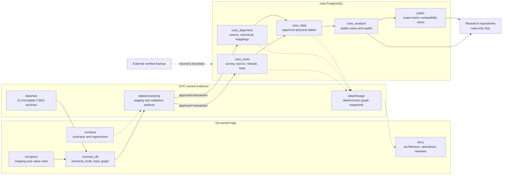
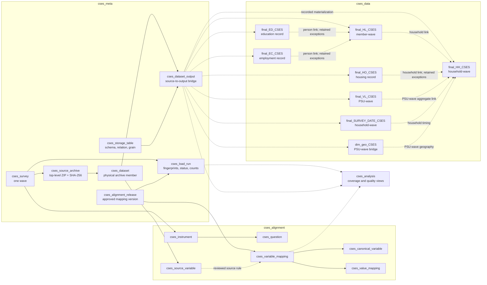
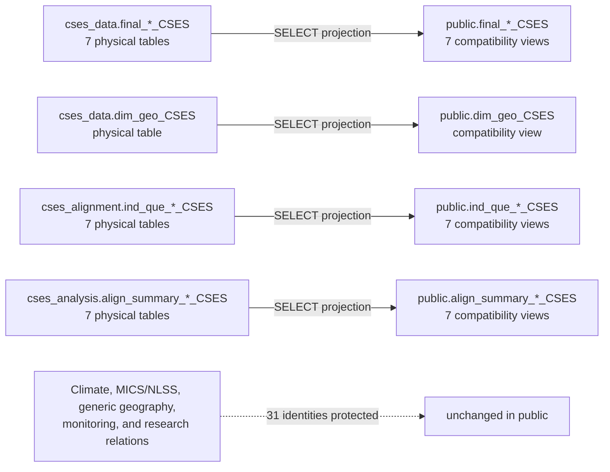
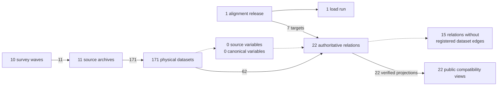
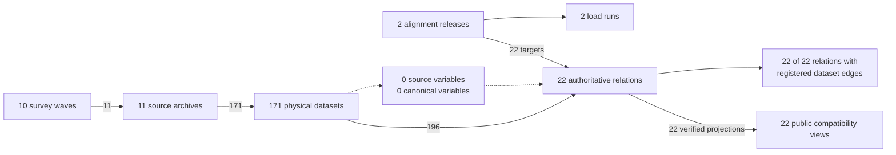
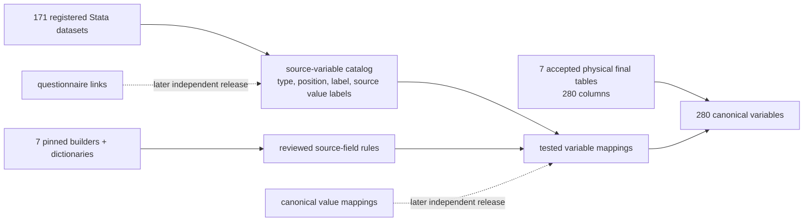
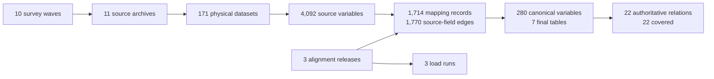

# CSES Database and Lineage Topology

[Documentation index](README.md) · [Architecture](cses-database-architecture.md) · [Processing workflow](cses-processing-workflow.md)

## End-to-end control flow

The diagram separates versioned evidence, transactional state, and downstream read-only use. A solid
arrow changes the next layer; a dashed arrow is validation or projection.

## Relational lineage model

A solid arrow is a proposed enforced foreign key. A dashed arrow is a validated relationship that may
retain documented unmatched source records.

## Implemented physical ownership and compatibility

This is the validated state after migration v1. Physical OIDs, rows, columns, indexes, constraints,
owners, and grants were preserved; `mda_readonly` can query both the functional schemas and compatibility
views.

## Deterministic database projection v1: pre-storage-provenance snapshot

The database-backed v1 snapshot is a forced read-only projection of the accepted baseline state before
the storage-provenance release. It
contains 244 natural-key nodes and 516 sorted edges. Two consecutive exports were byte-identical.

The full JSON graph is `data/lineage/cses_lineage_graph_v1.json`; the generated aggregate Mermaid source
is `data/lineage/cses_lineage_overview_v1.mmd`. Both are DVC-owned and are reproducible with the
[lineage export runbook](cses-lineage-export-runbook.md).

The v1 snapshot kept direct source coverage deliberately incomplete rather than inferred:

| Storage family | Registered relations | Relations with dataset-output edges | Visible gaps |
|---|---:|---:|---:|
| Final tables | 7 | 7 | 0 |
| Geography | 1 | 0 | 1 |
| Source dictionaries | 7 | 0 | 7 |
| Alignment summaries | 7 | 0 | 7 |

The geography edge and 14 inherited dictionary/summary edges required reviewed evidence. The normalized
instrument, question, source-variable, canonical-variable, and mapping tables are currently empty; the
graph will extend those paths automatically as later reviewed releases populate them.

## Deterministic database projection v2: complete storage coverage

The accepted `cses-storage-provenance-v1` release added one alignment release, 134 reviewed
dataset-output edges, and one load run. The post-import v2 projection contains 246 natural-key nodes and
678 sorted edges. Two consecutive forced read-only exports were byte-identical.

| Storage family | Registered relations | Relations with dataset-output edges | Visible gaps |
|---|---:|---:|---:|
| Final tables | 7 | 7 | 0 |
| Geography | 1 | 1 | 0 |
| Source dictionaries | 7 | 7 | 0 |
| Alignment summaries | 7 | 7 | 0 |

The post-import files are `data/lineage/cses_lineage_graph_v2.json` and
`data/lineage/cses_lineage_overview_v2.mmd`. Snapshot v1 remains immutable because it is fingerprinted
input evidence for the storage-provenance plan. The two non-CSES Cambodia boundary relations remain
documented external dependencies, and the variable-level alignment tables remain empty by design.

## Variable catalog v1 review boundary

The next release uses the existing `cses_alignment` model rather than introducing another schema. Its
read-only plan is built from all 171 registered Stata members and the exact seven-table physical
contract:

Blank dictionary inputs remain canonical-only derivations. Stata value labels stay attached to source
variables and are not treated as reviewed cross-wave category mappings. See the
[variable catalog runbook](cses-variable-catalog-runbook.md) for the exact write gate and validation
sequence.

## Deterministic database projection v3: variable catalog

The accepted `cses-variable-catalog-v1` release added 4,092 physical source variables, 280 canonical
variables, 1,714 tested mapping records, one alignment release, and one load run. Its independent
read-only validation reconciled all 6,088 planned records as exact no-ops.

The full projection contains 4,620 natural-key nodes and 7,017 sorted edges. Of the 280 canonical
variables, 194 have at least one reviewed source mapping; the remaining 86 stay canonical-only instead
of receiving invented raw fields. Instruments, questions, and canonical value mappings remain empty.

The DVC-owned files are `data/lineage/cses_lineage_graph_v3.json` and
`data/lineage/cses_lineage_overview_v3.mmd`. Both were reproduced byte-for-byte in consecutive exports.
Graph v1 and graph v2 remain immutable historical projections.
